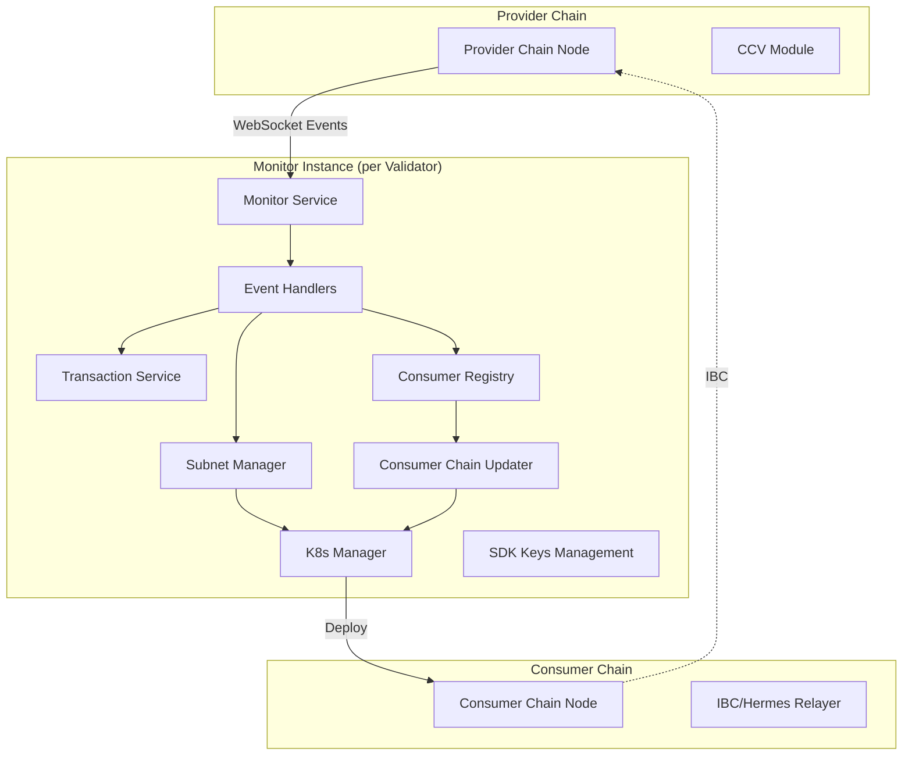
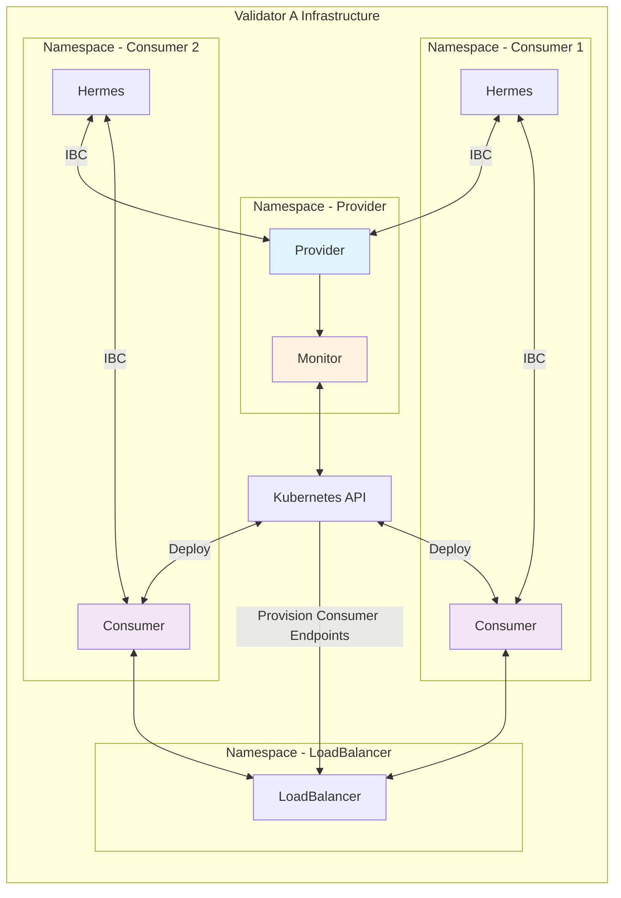
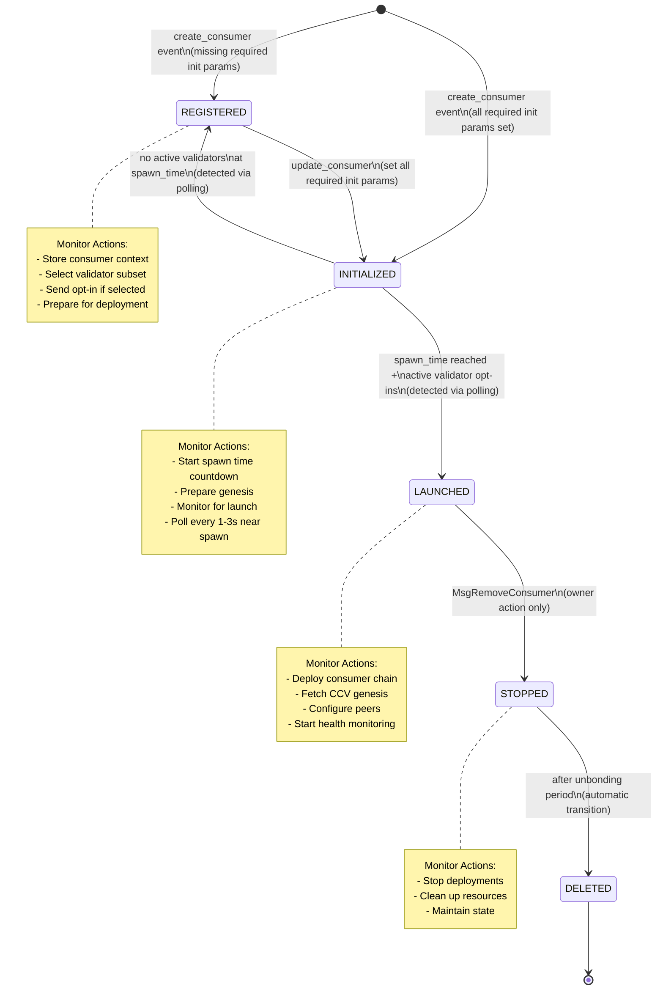
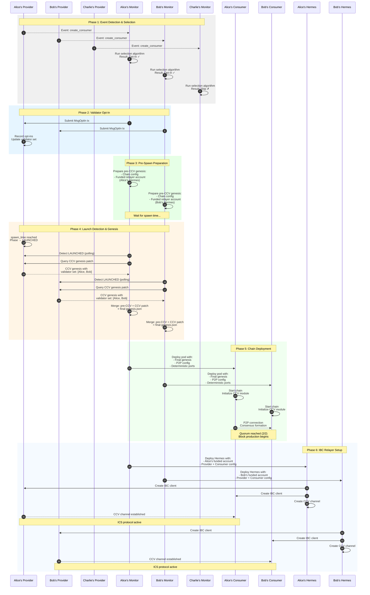
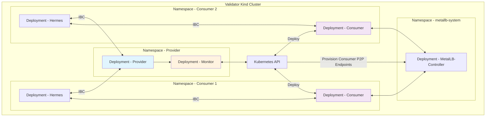

# Interchain Security Monitor

An orchestration layer for Cosmos Interchain Security that automates validator operations and consumer chain deployments using a stateless, decentralized architecture.

## Overview

The Interchain Security Monitor acts as an autonomous orchestrator that:

- Monitors Cross-Chain Validation (CCV) module events from provider chains
- Automates validator opt-in/opt-out decisions for consumer chains
- Manages consumer chain lifecycle (spawn → operate → stop → delete)
- Operates independently without coordination between validators
- Uses LoadBalancer-based peer discovery for production deployments
- Supports automatic updates when validator endpoints change
- Provides manual consumer chain updates via script invocation
- Enables late-joining validators to participate after chain launch

## Table of Contents

- [Architecture](#architecture)
- [Key Features](#key-features)
- [Consumer Chain Lifecycle](#consumer-chain-lifecycle)
- [Quick Start](#quick-start)
- [Production Deployment](#production-deployment)
- [Design Decisions](#design-decisions)
- [Configuration](#configuration)
- [Development](#development)
- [Troubleshooting](#troubleshooting)
- [Contributing](#contributing)

## Architecture

### System Components



### Core Design Principles

1. **Complete Independence**: Each validator operates autonomously with no shared state
2. **Event-Driven**: Reactive to blockchain events with polling fallback
3. **Deterministic Behavior**: Same inputs produce same outputs across all validators
4. **Failure Isolation**: One validator's issues don't cascade to others
5. **Stateless Operation**: No persistent state beyond blockchain data
6. **LoadBalancer-based Discovery**: Production-ready peer discovery using cloud LoadBalancers

### Production Architecture



## Key Features

### Implemented ✅

- **Event-Driven Architecture**: Real-time WebSocket monitoring with automatic reconnection
- **Automated Opt-In Logic**: Deterministic validator selection algorithm (top 66% by voting power)
- **Consumer Chain Deployment**: Full Kubernetes-based deployment automation
- **LoadBalancer-based Peer Discovery**: Production-ready networking for cloud deployments
- **Phase Tracking**: Complete consumer chain lifecycle management
- **Health Monitoring**: Continuous monitoring of deployed consumer chains
- **Transaction Management**: Automated opt-in/opt-out with retry logic
- **State Persistence**: Durable storage of consumer chain contexts
- **Automatic Updates**: Zero-downtime updates when validator endpoints change (optional)
- **Manual Updates**: Script-based consumer chain updates via monitor invocation
- **Key Management**: Standard Cosmos SDK key management with import/export
- **Late-Joining Validators**: Support for validators joining after chain launch
- **Consumer Key Assignment**: Automatic handling of assigned consumer keys in genesis
- **Hybrid Peer Updates**: RPC-based peer updates with restart fallback

### TODO

- **Hermes Integration**: Automated IBC relayer deployment and configuration
- **Kubernetes Operator**: Turn the monitor into a Kubernetes Operator
- **Test/Improve Cloud Deployment**: Improve deployment operator experiance

## Consumer Chain Lifecycle

### Phase Overview



### Detailed Lifecycle Steps

```mermaid
sequenceDiagram
    autonumber
    participant U as User/Script
    participant P as Provider Chain
    participant M as Monitor
    participant K as Kubernetes
    participant C as Consumer Chain
    participant H as Hermes Relayer

    %% Phase 1: Consumer Creation & Registration
    rect rgb(240, 248, 255)
        Note over U,P: PHASE 1: CONSUMER CREATION
        U->>P: MsgCreateConsumer<br/>(chain_id, spawn_time, params)
        Note right of U: Via create-consumer.sh<br/>or monitor CLI
        P->>P: Assign consumer_id<br/>Set phase: REGISTERED or INITIALIZED<br/>(INITIALIZED if all init params valid)
        P->>M: create_consumer event<br/>(consumer_id, chain_id, phase, init_params)
    end

    %% Phase 2: Event Processing & Validator Selection
    rect rgb(245, 255, 250)
        Note over M,P: PHASE 2: VALIDATOR SELECTION
        M->>M: Store consumer context<br/>with mutex protection
        M->>M: Calculate validator subset<br/>(66% deterministic selection)
        M->>M: Check if local validator selected

        opt Local validator selected (66% probability)
            M->>P: Send MsgOptIn transaction
            P->>M: opt_in event confirmation
        end
    end

    %% Background Sync Process
    rect rgb(255, 250, 240)
        Note over M,P: BACKGROUND: STATE SYNC
        loop Every 30 seconds
            M->>P: Query all consumer states
            P->>M: Consumer info with phases
            M->>M: Update cache & contexts
        end
    end

    %% Phase 3: Spawn Time Monitoring
    rect rgb(255, 245, 245)
        Note over M,P: PHASE 3: SPAWN MONITORING
        M->>M: Detect phase: INITIALIZED
        M->>M: Start spawn time monitor<br/>with cancellation context

        loop Every 5 seconds until spawn
            M->>M: Check remaining time
            Note right of M: Countdown display
        end

        Note over M,P: Spawn time reached!
    end

    %% Phase 4: Launch Detection
    rect rgb(245, 245, 255)
        Note over M,P: PHASE 4: LAUNCH DETECTION
        alt Event-driven (primary path)
            P->>M: update_consumer event<br/>(phase: LAUNCHED)
            M->>M: Cancel spawn monitoring
            M->>M: Trigger HandlePhaseTransition
        else Adaptive polling (fallback)
            loop Adaptive intervals
                M->>P: Query consumer status
                P->>M: Consumer phase
                Note right of M: 1s (0-30s)<br/>5s (30s-2m)<br/>30s (2m+)
            end
            M->>M: Detect LAUNCHED phase
        end
    end

    %% Phase 5: Consumer Deployment
    rect rgb(240, 255, 240)
        Note over M,K: PHASE 5: DEPLOYMENT
        M->>P: Fetch CCV genesis patch<br/>(5 retries, 2s delay)
        P->>M: Genesis with validator set

        M->>M: Calculate deterministic ports<br/>Base + 100 + (hash % 1000) * 10
        M->>M: Discover peers from validators

        M->>K: Deploy consumer chain
        K->>K: ConfigMap (script + genesis)
        K->>K: Service (P2P/RPC/API/gRPC)
        K->>K: PVC (10Gi storage)
        K->>C: Deployment Pod
    end

    %% Phase 6: Chain Initialization
    rect rgb(250, 245, 255)
        Note over C: PHASE 6: INITIALIZATION
        C->>C: interchain-security-cd init
        C->>C: Add funded accounts
        C->>C: Apply CCV genesis patch
        C->>C: Configure persistent peers
        C->>C: Start chain daemon
    end

    %% Phase 7: Post-Deployment
    rect rgb(245, 250, 255)
        Note over M,H: PHASE 7: POST-DEPLOYMENT
        M->>C: Start health monitoring
        C->>M: Block production metrics

        Note over M: Wait 30 seconds
        M->>K: Deploy Hermes relayer
        K->>H: Start Hermes container
        H->>P: Establish IBC connection
        H->>C: Establish IBC connection
        P-->>C: IBC channel active
    end

    %% Ongoing Operations
    rect rgb(250, 250, 250)
        Note over M,C: ONGOING OPERATIONS
        par Health Monitoring
            loop Continuous
                M->>C: Check chain health
                C->>M: Health metrics
            end
        and Phase Monitoring
            loop Event-driven + 30s sync
                M->>P: Monitor phase changes
                alt Phase: STOPPED
                    M->>K: Scale to 0 replicas
                    M->>M: Clean up contexts
                else Phase: DELETED
                    M->>K: Delete all resources
                    M->>M: Remove from tracking
                end
            end
        end
    end
```



### Phase Detection Methods

**IMPORTANT**: The provider chain only emits events for `create_consumer`, `update_consumer`, and `remove_consumer` messages. It does NOT emit events for automatic phase transitions that occur during block processing.

| Phase Transition | Detection Method | Polling Interval | Notes |
|-----------------|------------------|------------------|-------|
| None → REGISTERED | `create_consumer` event | N/A | When created with missing init params |
| None → INITIALIZED | `create_consumer` event | N/A | When created with all required init params |
| REGISTERED → INITIALIZED | `update_consumer` event | N/A | When all required init params are set |
| INITIALIZED → LAUNCHED | Polling after spawn_time | 1s/3s/10s adaptive | Requires sufficient validator opt-ins |
| INITIALIZED → REGISTERED | Polling | 30s | If insufficient opt-ins before spawn |
| LAUNCHED → STOPPED | `remove_consumer` event + polling | 30s | Event only for removal, not phase change |
| STOPPED → DELETED | Polling | 30s | No event emitted |

### Why Polling is Required

The ICS v7 provider chain implementation only emits events during message handling (when transactions are processed), not during automatic state transitions that occur in `BeginBlock`. This means:

1. **Phase transitions are silent**: When a consumer chain transitions from INITIALIZED to LAUNCHED because validators have opted in, no event is emitted.
2. **Polling is necessary**: The monitor must actively query the blockchain to detect these phase changes.
3. **Timing is unpredictable**: The exact block when a phase transition occurs depends on validator actions and chain processing.

### Critical Requirements for Phase Transitions

#### REGISTERED → INITIALIZED Requirements

A consumer chain transitions to INITIALIZED only when ALL required initialization parameters are set:

1. **spawn_time**: Must be a valid future timestamp (not zero/null)
2. **genesis_hash**: Genesis configuration hash
3. **binary_hash**: Binary hash for deterministic builds
4. **unbonding_period**: Chain unbonding period
5. **ccv_timeout_period**: CCV timeout configuration
6. **transfer_timeout_period**: IBC transfer timeout
7. **consumer_redistribution_fraction**: Distribution parameters
8. **blocks_per_distribution_transmission**: Distribution frequency
9. **historical_entries**: Number of historical entries to persist

**Note**: The most common issue is missing or invalid spawn_time, but all parameters must be valid.

#### INITIALIZED → LAUNCHED Requirements

For a consumer chain to successfully transition from INITIALIZED to LAUNCHED:

1. **Active validator opt-ins**: Validators who opt-in must be:
   - Part of the active validator set (bonded and not jailed)
   - Actually opted-in before spawn time (manual opt-ins count)
   - At least one active validator must have opted in

2. **Spawn time reached**: The current block time must be >= spawn_time

3. **Launch failure handling**: If launch fails at spawn time:
   - The chain reverts to REGISTERED phase
   - spawn_time is reset to zero (0001-01-01T00:00:00Z)
   - You must update the consumer to set a new spawn time

### Late-Joining Validators

The monitor supports validators who opt in AFTER the consumer chain has launched:

1. **Entry Condition**:
   - Validator opts in AFTER spawn time
   - Validator is NOT in the initial validator set
   - Consumer chain is already in LAUNCHED phase

2. **Deployment Process**:
   - Monitor detects the validator is opted in but not in initial set
   - Deploys consumer chain as a non-validator node
   - Node syncs the blockchain but doesn't produce blocks
   - Waits for VSC (Validator Set Change) from provider

3. **Automatic Promotion**:
   - Provider chain includes validator in next VSC packet
   - Hermes relays VSC to consumer chain
   - Consumer chain updates validator set
   - Validator automatically starts producing blocks

## Consumer Chain Deployment Process

This section describes the detailed process of how monitors deploy consumer chains after detecting the LAUNCHED phase.



### Monitoring Hermes Relayer Status

The system provides comprehensive monitoring of Hermes relayer operations:

```bash
# Show all Hermes relayers across all consumer chains
make hermes-status

# Show specific consumer chain's Hermes status
make hermes-status CHAIN_ID=consumer-0-xxx

# Verbose output with full details
make hermes-status CHAIN_ID=consumer-0-xxx VERBOSE=1
```

The hermes-status command shows:
- Hermes deployment status and health
- CCV channel connections and states
- Client and connection IDs
- Any errors or configuration issues

### Key Implementation Details

#### 1. Deterministic Validator Selection

Each monitor independently runs the same selection algorithm:

```go
// Query validators at the event height for determinism
validators := queryBondedValidatorsAtHeight(eventHeight)

// Sort by voting power (descending) with deterministic tiebreaker
sort.Slice(validators, func(i, j int) bool {
    if validators[i].Tokens.Equal(validators[j].Tokens) {
        return validators[i].OperatorAddress < validators[j].OperatorAddress
    }
    return validators[i].Tokens.GT(validators[j].Tokens)
})

// Select top validators until 66% voting power
targetPower := totalPower.MulRaw(66).QuoRaw(100)
```

#### 2. Pre-CCV Genesis Structure

Monitors prepare the base genesis with funded relayer accounts:

```json
{
  "chain_id": "consumer-1",
  "initial_height": "1",
  "app_state": {
    "auth": { ... },
    "bank": {
      "balances": [
        {
          "address": "consumer1abc...", // Alice's Hermes account
          "coins": [{"denom": "stake", "amount": "10000000"}]
        }
      ]
    }
    // NO ccvconsumer section yet
  }
}
```

#### 3. CCV Genesis Query & Merge

After detecting LAUNCHED phase:

```bash
# Query CCV genesis patch
interchain-security-pd query provider consumer-genesis [consumer-id]

# Merge with pre-CCV genesis
jq '.app_state.ccvconsumer = $ccv' genesis.json --argjson ccv "$CCV_GENESIS"
```

#### 4. Consumer Key Assignment

The monitor automatically handles assigned consumer keys:

- Queries assigned keys from ConsumerKeyStore
- Updates CCV genesis initial validator set with assigned keys
- Converts key formats (handles PubKeyEd25519{hex} to simple ed25519 format)
- Ensures consumer chains start with correct validator keys

#### 5. Relayer Account Funding

Each validator's monitor funds their own Hermes relayer:

- **Alice's monitor** → Funds Alice's Hermes account
- **Bob's monitor** → Funds Bob's Hermes account
- **No shared accounts** → Each relayer is independent

#### 6. Hermes Configuration

Each monitor deploys Hermes with:

```toml
[[chains]]
id = 'provider-1'
rpc_addr = 'http://validator-alice:26657'
grpc_addr = 'http://validator-alice:9090'
key_name = 'alice-relayer'
account_prefix = 'cosmos'

[[chains]]
id = 'consumer-1'
rpc_addr = 'http://consumer-1-alice:26657'
grpc_addr = 'http://consumer-1-alice:9090'
key_name = 'alice-relayer'
account_prefix = 'consumer'
```

### Deployment Coordination

While monitors act independently, they achieve coordination through:

1. **Deterministic Selection**: Same algorithm ensures consistent validator subset
2. **Genesis Determinism**: All monitors create identical genesis (except relayer accounts)
3. **P2P Discovery**: Consumer nodes find each other via LoadBalancer endpoints
4. **Channel Reuse**: First relayer creates CCV channel, others detect and reuse

### Consumer Chain Removal in ICS v7

**IMPORTANT**: Consumer chains can only be removed when in LAUNCHED phase.

#### Removal Process

1. **Phase Requirement**: The consumer chain MUST be in LAUNCHED phase
   - Attempting removal in other phases results in error: "chain has to be in its launched phase"
   - If stuck in REGISTERED/INITIALIZED, you must first get it to LAUNCHED

2. **Who Can Remove**: Only the chain owner can remove their consumer chain
   - No governance proposal required in ICS v7
   - Uses `MsgRemoveConsumer` transaction

3. **Phase Transitions During Removal**:
   - LAUNCHED → STOPPED (immediate)
   - STOPPED → DELETED (after unbonding period)
   - Validators immediately stop validating when chain enters STOPPED phase

## Quick Start

### Prerequisites

- Kubernetes cluster (or Kind/Minikube for testing)
- kubectl
- Docker
- Helm 3 (for Helm deployments)

```bash
make quick-start
```

This will:

1. Deploy a 3-validator devnet
2. Install MetalLB for as a Kubernetes LoadBalancer
3. Register validator endpoints
4. Create a consumer chain
5. Wait for it to start producing blocks
6. Show you the status

The whole process takes about 5 minutes.

Check [Quick Start Guide](docs/quick-start.md) for details

### Devnet Architecture

The devnet consists of:

- **3 Validators**: alice, bob, and charlie with deterministic keys
- **3 Monitors**: One per validator, monitoring and managing consumer chains
- **LoadBalancer Services**: Enable cross-cluster peer discovery
- **MetalLB**: Provides LoadBalancer IPs for Kind clusters

Each validator:

- Runs `interchain-security-pd`
- Has its own home directory at `/chain/.provider`
- Connects to other validators via LoadBalancer services
- Exposes RPC, API, and gRPC endpoints

Each monitor:

- Connects to its validator's RPC endpoint
- Has permissions to create consumer chain deployments
- Monitors CCV events and spawns consumer chains automatically
- Uses validator's keyring for signing transactions

## Production Deployment

### Validator Infrastructure



### Network Architecture

Consumer chains use deterministic port allocation:

```go
// Deterministic port calculation
port = BaseProviderPort + 100 + (hash(chainID) % 1000) * PortSpacing
```

- P2P Port: `26656 + 100 + (hash % 1000) * 10`
- RPC Port: `26657 + 100 + (hash % 1000) * 10`
- gRPC Port: `9090 + 100 + (hash % 1000) * 10`

Benefits:

- No shared state or coordination needed
- Predictable port allocation
- Easy debugging and recovery
- Works across different infrastructures

### LoadBalancer-based Peer Discovery

The production deployment uses LoadBalancer services for peer discovery:

1. **Validator Registration**: Each validator registers their LoadBalancer endpoint on-chain
2. **Endpoint Discovery**: Consumer chains query on-chain registry for peer endpoints
3. **Direct TCP**: LoadBalancers provide direct TCP connectivity (required for Tendermint)
4. **Cloud Support**: Works with AWS NLB, GCP Load Balancer, Azure Load Balancer

```bash
# Register validator endpoint
interchain-security-pd tx staking edit-validator \
  --details "p2p=alice-lb.example.com" \
  --from alice
```

### Automatic Consumer Chain Updates

When validator endpoints change, the monitor can automatically update consumer chains:

```bash
# Enable automatic updates
export AUTO_UPDATE_CONSUMERS=true

# Enable hybrid mode (RPC first, restart fallback)
export HYBRID_PEER_UPDATES=true
```

Features:

- **ConsumerRegistry**: Tracks validator-to-consumer mappings
- **ConfigMap Updates**: Modifies peer configurations
- **Safe Restarts**: Health checks ensure minimal disruption
- **Hybrid Mode**: Zero-downtime updates when possible

## Design Decisions

### Stateless Peer Discovery

The LoadBalancer-based peer discovery was chosen for production readiness:

1. **LoadBalancer Services (Selected)**
   - Production-ready cloud integration
   - Direct TCP connectivity
   - Works across regions and clouds
   - No cleanup needed

2. **On-Chain Registry (Rejected)**
   - Would require gas fees for registration
   - Adds complexity and failure modes
   - Not truly stateless

3. **DNS Pattern (Rejected)**
   - Requires DNS infrastructure management
   - Cleanup complexity when chains are removed
   - Not all validators have DNS control

### Automated Validator Selection

Implements deterministic 66% subset selection:

```go
// Select ~66% of validators deterministically
// Query at event height for perfect determinism
validators := queryBondedValidatorsAtHeight(eventHeight)

// Sort by voting power with deterministic tiebreaker
// Select top validators until 66% voting power
```

**Important Notes**:

1. This selection represents the **minimum required validators**, not a maximum
2. **Monitor Identity Matters**: The monitor only opts-in its own validator if selected
3. **Launch Requirements**: At least one active validator must opt-in for launch

### ICS Consumer Chain Deployment Philosophy

Consumer chains in Interchain Security have fundamentally different properties:

1. **Security Model**: Security comes from the provider chain via cross-chain validation
2. **Validator Role**: Validators are **service providers**, not security providers
3. **Consensus**: Voting power is **replicated** from provider chain via IBC

Benefits of multiple deployments:

- **Geographic Distribution**: Better global coverage
- **Improved Availability**: Redundancy for RPC endpoints
- **Enhanced Resilience**: Network survives if required validators fail
- **Load Distribution**: More nodes to handle queries

## Configuration

### Monitor Configuration

```yaml
# config.yaml
rpc_url: "tcp://localhost:26657"
from_key: "validator-key"
work_dir: "/tmp/subnet-data"
deployment:
  type: "kubernetes"
  namespace: "provider"
```

### Environment Variables

```bash
# Provider chain connection
PROVIDER_RPC_URL=tcp://localhost:26657
PROVIDER_GRPC_URL=localhost:9090

# Validator identity
VALIDATOR_KEY_NAME=validator-key
CHAIN_ID=provider-1

# Deployment settings
DEPLOYMENT_TYPE=kubernetes
K8S_NAMESPACE=provider

# Feature flags
AUTO_UPDATE_CONSUMERS=true
HYBRID_PEER_UPDATES=true
```

### Helm Values

```yaml
validator:
  name: alice
  index: 0

keys:
  type: "mnemonic"
  mnemonic: "your-mnemonic-here"

monitor:
  enabled: true
  resources:
    requests:
      memory: "256Mi"
      cpu: "100m"
```

### Polling Intervals (Configurable)

```go
// Default intervals
const (
    BackgroundSyncInterval = 30 * time.Second
    SpawnCheckInterval     = 5 * time.Second
    RapidPollInterval      = 1 * time.Second
    ActivePollInterval     = 5 * time.Second
    SlowPollInterval       = 30 * time.Second
)
```

## Development

### Building from Source

```bash
# Build monitor binary
go build -o monitor ./cmd/monitor

# Build Docker image
docker build -t ics-monitor:latest .

# Run tests
go test ./...

# Load into Kind cluster
kind load docker-image ics-monitor:latest
```

## Troubleshooting

See [docs/troubleshooting.md](docs/troubleshooting.md) for comprehensive troubleshooting.

Common issues:

- **Consumer stuck in REGISTERED**: Missing initialization parameters
- **Consumer reverts to REGISTERED**: No active validators opted in
- **Cannot remove consumer**: Must be in LAUNCHED phase first
- **No blocks produced**: Check consumer keys, ports, and peer discovery
- **LoadBalancer pending**: Install MetalLB for Kind clusters

## Contributing

Please follow these guidelines:

1. Fork the repository
2. Create a feature branch (`git checkout -b feature/amazing-feature`)
3. Follow conventions in `scripts/CONVENTIONS.md` for scripts
4. Commit your changes (`git commit -m 'Add amazing feature'`)
5. Push to the branch (`git push origin feature/amazing-feature`)
6. Open a Pull Request

## License

This project is licensed under the Apache License 2.0 - see the [LICENSE](LICENSE) file for details.

## References

- [Interchain Security Documentation](https://cosmos.github.io/interchain-security/)
- [Cosmos SDK Documentation](https://docs.cosmos.network/)
- [IBC Protocol Specification](https://github.com/cosmos/ibc)
- [ICS Provider Query APIs](docs/ics-provider-query-apis.md)
