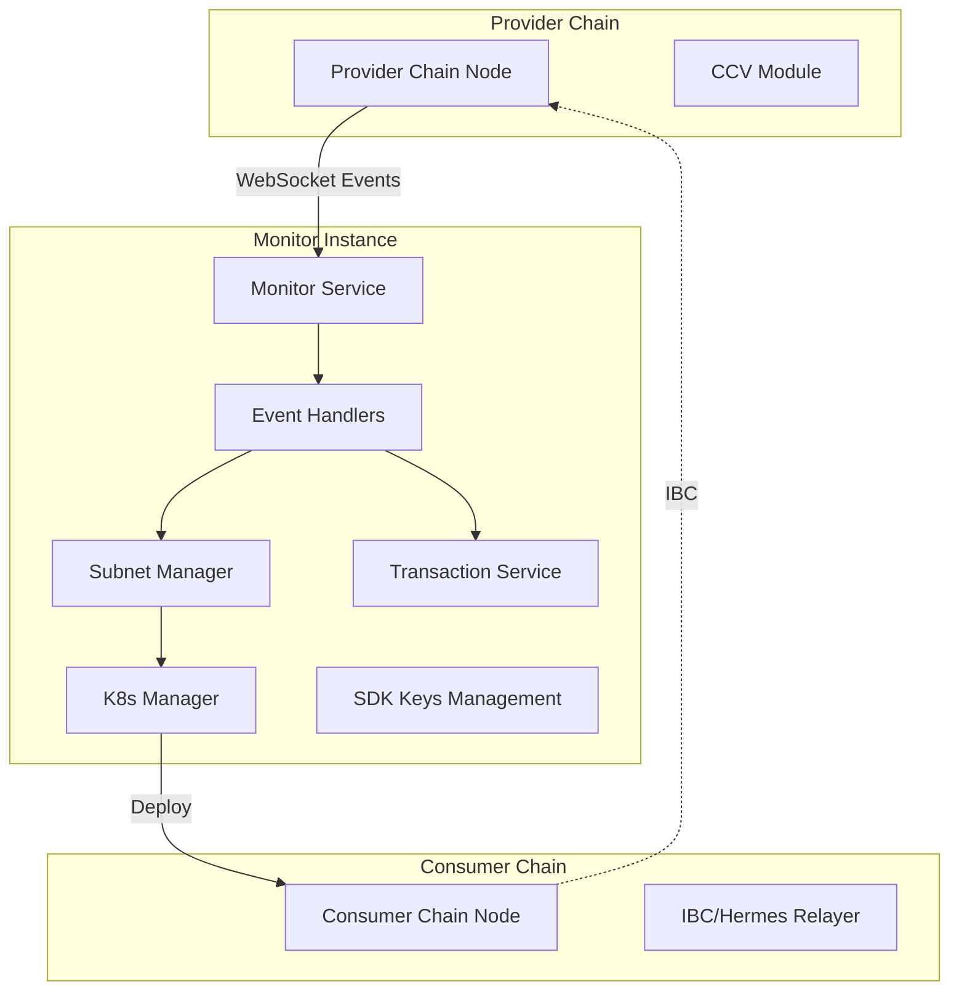
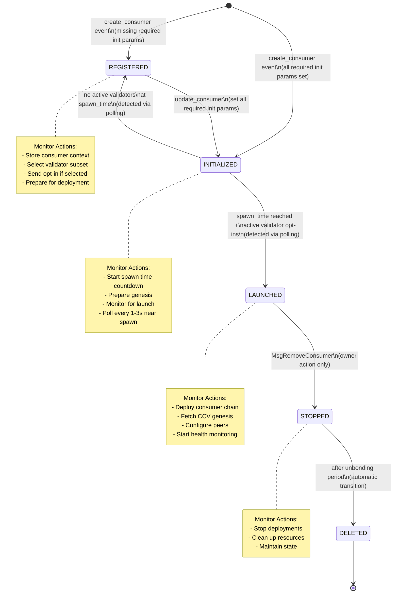
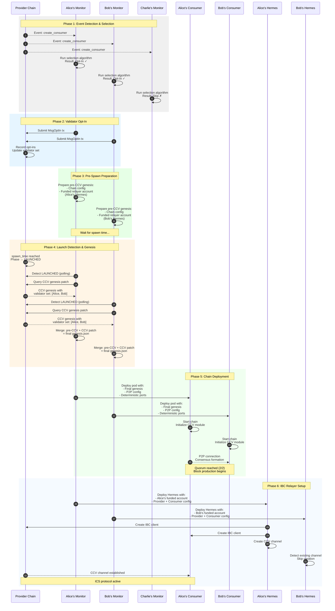
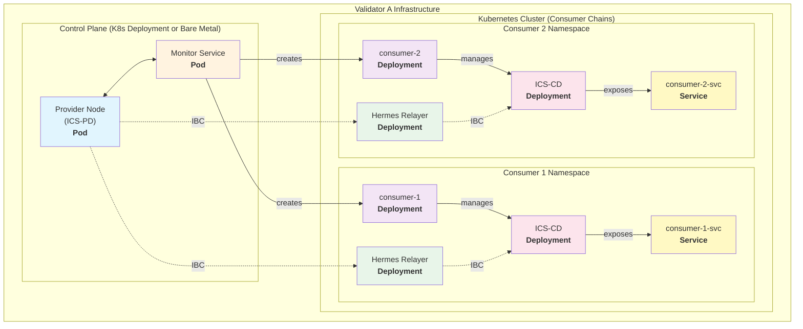

# Interchain Security Monitor

An orchestration layer for Cosmos Interchain Security that automates validator operations and consumer chain deployments using a stateless, decentralized architecture.

## Overview

The Interchain Security Monitor acts as an autonomous orchestrator that:

- Monitors Cross-Chain Validation (CCV) module events from provider chains
- Automates validator opt-in/opt-out decisions for consumer chains
- Manages consumer chain lifecycle (spawn → operate → stop → delete)
- Operates independently without coordination between validators
- Uses stateless peer discovery for production deployments

## Table of Contents

- [Architecture](#architecture)
- [Consumer Chain Lifecycle](#consumer-chain-lifecycle)
- [Quick Start](#quick-start)
- [Production Deployment](#production-deployment)
- [Design Decisions](#design-decisions)
- [Testing](#testing)
- [Configuration](#configuration)
- [Development](#development)
- [Troubleshooting](#troubleshooting)
- [Contributing](#contributing)

## Architecture

### System Components



### Core Design Principles

1. **Stateless Operation**: No coordination required between monitors
2. **Independent Validators**: Each validator runs their own monitor instance
3. **Deterministic Behavior**: Same inputs always produce same outputs
4. **Failure Isolation**: One validator's issues don't affect others
5. **Production Ready**: Works across diverse validator infrastructures

## Consumer Chain Lifecycle

### Phase Overview



### Detailed Lifecycle Steps


### Phase Detection Methods

**IMPORTANT**: The provider chain only emits events for `create_consumer`, `update_consumer`, and `remove_consumer` messages. It does NOT emit events for automatic phase transitions that occur during block processing.

| Phase Transition | Detection Method | Polling Interval | Notes |
|-----------------|------------------|------------------|-------|
| None → REGISTERED | `create_consumer` event | N/A | When created with missing init params |
| None → INITIALIZED | `create_consumer` event | N/A | When created with all required init params |
| REGISTERED → INITIALIZED | `update_consumer` event | N/A | When all required init params are set |
| INITIALIZED → LAUNCHED | Polling after spawn_time | 1s/3s/10s adaptive | Requires sufficient validator opt-ins |
| INITIALIZED → REGISTERED | Polling | 30s | If insufficient opt-ins before spawn |
| LAUNCHED → STOPPED | `remove_consumer` event + polling | 30s | Event only for removal, not phase change |
| STOPPED → DELETED | Polling | 30s | No event emitted |

### Why Polling is Required

The ICS v7 provider chain implementation only emits events during message handling (when transactions are processed), not during automatic state transitions that occur in `BeginBlock`. This means:

1. **Phase transitions are silent**: When a consumer chain transitions from INITIALIZED to LAUNCHED because validators have opted in, no event is emitted.
2. **Polling is necessary**: The monitor must actively query the blockchain to detect these phase changes.
3. **Timing is unpredictable**: The exact block when a phase transition occurs depends on validator actions and chain processing.

### Critical Requirements for Phase Transitions

#### REGISTERED → INITIALIZED Requirements

A consumer chain transitions to INITIALIZED only when ALL required initialization parameters are set:

1. **spawn_time**: Must be a valid future timestamp (not zero/null)
2. **genesis_hash**: Genesis configuration hash
3. **binary_hash**: Binary hash for deterministic builds
4. **unbonding_period**: Chain unbonding period
5. **ccv_timeout_period**: CCV timeout configuration
6. **transfer_timeout_period**: IBC transfer timeout
7. **consumer_redistribution_fraction**: Distribution parameters
8. **blocks_per_distribution_transmission**: Distribution frequency
9. **historical_entries**: Number of historical entries to persist

**Note**: The most common issue is missing or invalid spawn_time, but all parameters must be valid.

#### INITIALIZED → LAUNCHED Requirements

For a consumer chain to successfully transition from INITIALIZED to LAUNCHED:

1. **Active validator opt-ins**: Validators who opt-in must be:
   - Part of the active validator set (bonded and not jailed)
   - Actually opted-in before spawn time (manual opt-ins count)
   - At least one active validator must have opted in

2. **Spawn time reached**: The current block time must be >= spawn_time

3. **Launch failure handling**: If launch fails at spawn time:
   - The chain reverts to REGISTERED phase
   - spawn_time is reset to zero (0001-01-01T00:00:00Z)
   - You must update the consumer to set a new spawn time

## Consumer Chain Deployment Process

This section describes the detailed process of how monitors deploy consumer chains after detecting the LAUNCHED phase.



### Key Implementation Details

#### 1. Deterministic Validator Selection
Each monitor independently runs the same selection algorithm:
```go
hash := sha256(validatorAddress + consumerChainID)
shouldOptIn := hash[0] < threshold // e.g., 2/3 probability
```

#### 2. Pre-CCV Genesis Structure
Monitors prepare the base genesis with funded relayer accounts:
```json
{
  "chain_id": "consumer-1",
  "initial_height": "1",
  "app_state": {
    "auth": { ... },
    "bank": {
      "balances": [
        {
          "address": "consumer1abc...", // Alice's Hermes account
          "coins": [{"denom": "stake", "amount": "10000000"}]
        }
      ]
    }
    // NO ccvconsumer section yet
  }
}
```

#### 3. CCV Genesis Query & Merge
After detecting LAUNCHED phase:
```bash
# Query CCV genesis patch
interchain-security-pd query provider consumer-genesis [consumer-id]

# Merge with pre-CCV genesis
jq '.app_state.ccvconsumer = $ccv' genesis.json --argjson ccv "$CCV_GENESIS"
```

#### 4. Relayer Account Funding
Each validator's monitor funds their own Hermes relayer:
- **Alice's monitor** → Funds Alice's Hermes account
- **Bob's monitor** → Funds Bob's Hermes account
- **No shared accounts** → Each relayer is independent

#### 5. Hermes Configuration
Each monitor deploys Hermes with:
```toml
[[chains]]
id = 'provider-1'
rpc_addr = 'http://validator-alice:26657'
grpc_addr = 'http://validator-alice:9090'
key_name = 'alice-relayer'
account_prefix = 'cosmos'

[[chains]]
id = 'consumer-1'
rpc_addr = 'http://consumer-1-alice:26657'
grpc_addr = 'http://consumer-1-alice:9090'
key_name = 'alice-relayer'
account_prefix = 'consumer'
```

### Deployment Coordination

While monitors act independently, they achieve coordination through:

1. **Deterministic Selection**: Same algorithm ensures consistent validator subset
2. **Genesis Determinism**: All monitors create identical genesis (except relayer accounts)
3. **P2P Discovery**: Consumer nodes find each other via configured seeds
4. **Channel Reuse**: First relayer creates CCV channel, others detect and reuse
   - Ensure validators opt-in before the new spawn time

**Important**: The monitor's deterministic selection (67% of validators) is a recommendation. If those specific validators don't opt-in, you may need to manually opt-in other validators to meet the minimum requirements.

### Consumer Chain Removal in ICS v7

**IMPORTANT**: Consumer chains can only be removed when in LAUNCHED phase.

#### Removal Process

1. **Phase Requirement**: The consumer chain MUST be in LAUNCHED phase
   - Attempting removal in other phases results in error: "chain has to be in its launched phase"
   - If stuck in REGISTERED/INITIALIZED, you must first get it to LAUNCHED

2. **Who Can Remove**: Only the chain owner can remove their consumer chain
   - No governance proposal required in ICS v7
   - Uses `MsgRemoveConsumer` transaction

3. **Phase Transitions During Removal**:
   - LAUNCHED → STOPPED (immediate)
   - STOPPED → DELETED (after unbonding period)
   - Validators immediately stop validating when chain enters STOPPED phase

#### Handling Stuck Consumer Chains

If a consumer chain is stuck in REGISTERED or INITIALIZED phase:

```bash
# Option 1: Force launch by updating spawn time and opting in all validators
./scripts/lifecycle/force-launch-consumer.sh 0 -s 30

# Option 2: Manual steps
# Update spawn time
./scripts/lifecycle/update-consumer.sh 0 -d 60

# Manually opt-in validators (if force-launch script not used)
# The force-launch script already handles opt-ins for all validators

# Wait for spawn time and check phase
# Once in LAUNCHED phase, remove it
./scripts/lifecycle/remove-consumer.sh 0
```

### Adaptive Polling Strategy

The monitor uses different polling intervals based on context:

1. **Background Sync**: Every 30 seconds
   - Detects any phase changes
   - Catches missed events
   - Updates cache

2. **Spawn Time Monitoring**:
   - **Pre-spawn**: Check every 5 seconds
   - **Post-spawn (0-30s)**: Poll every 1 second
   - **Post-spawn (30s-2m)**: Poll every 5 seconds
   - **Post-spawn (>2m)**: Poll every 30 seconds

3. **Health Monitoring**: Every 30 seconds for deployed chains

## Quick Start

### Prerequisites

- Kubernetes cluster (or Kind/Minikube for testing)
- kubectl
- Docker

### Build and Deploy

```bash
# Generate testnet assets and manifests
make generate-testnet

# Build and deploy complete testnet with monitors
make deploy

# Check deployment status
make status

# View monitor logs
make logs TARGET=monitor

# Create a test consumer chain
make create-consumer

# Monitor CCV events
make monitor-events
```

### Testnet Architecture

The testnet consists of:

- **3 Validators**: alice, bob, and charlie with deterministic keys
- **1 Monitor**: Monitors all validators and handles consumer chain deployments
- **Dynamic Configuration**: Genesis ceremony performed during setup

Each validator:

- Runs `interchain-security-pd`
- Has its own home directory at `/chain/.provider`
- Connects to other validators via P2P networking
- Exposes RPC, API, and gRPC endpoints

The monitor:

- Connects to all validators' RPC endpoints
- Has permissions to create consumer chain deployments
- Monitors CCV events and spawns consumer chains automatically
- Uses keyring imported from all validators

### Key Management

The testnet uses deterministic HD key derivation:

- Single root mnemonic generates all validator accounts
- HD paths: m/44'/118'/0'/0/0 (alice), m/44'/118'/1'/0/0 (bob), m/44'/118'/2'/0/0 (charlie)
- P2P and consensus keys can be optionally saved/restored for consistency

## Production Deployment

### Validator Infrastructure



### Network Architecture

Consumer chains use deterministic port allocation:

```go
// Deterministic port calculation
port = BaseProviderPort + 100 + (hash(consumerID) % 1000) * PortSpacing
```

- P2P Port: `26656 + 100 + (hash % 1000) * 10`
- RPC Port: `26657 + 100 + (hash % 1000) * 10`
- gRPC Port: `9090 + 100 + (hash % 1000) * 10`

Benefits:

- No shared state or coordination needed
- Predictable port allocation
- Easy debugging and recovery
- Works across different infrastructures

## Design Decisions

### Stateless Peer Discovery

The stateless peer discovery mechanism was chosen over several alternatives:

1. **Port Convention (Selected)**
   - Deterministic port = `BasePort + 100 + (hash(consumerID) % 1000) * 10`
   - No cleanup needed, fully recoverable
   - Works across different infrastructures

2. **On-Chain Registry (Rejected)**
   - Would require gas fees for registration
   - Adds complexity and failure modes
   - Not truly stateless

3. **DNS Pattern (Rejected)**
   - Requires DNS infrastructure management
   - Cleanup complexity when chains are removed
   - Not all validators have DNS control

### Automated Validator Selection

Implements deterministic 67% subset selection:

```go
// Select ~67% of validators deterministically
for _, val := range validators {
    hash := sha256.Sum256([]byte(consumerChainID + val.Address))
    if binary.BigEndian.Uint64(hash[:8])%100 < 67 {
        selected = append(selected, val.Address)
    }
}
```

**Important Notes**:
1. This selection represents the **minimum required validators**, not a maximum. Non-selected validators can still participate by manually opting in, which can improve network resilience and availability.
2. **Monitor Identity Matters**: The monitor only opts-in its own validator if selected. If the monitor runs as validator A but the algorithm selects validators B and C, those validators won't automatically opt-in unless they have their own monitors running.
3. **Launch Requirements**: At least one active (bonded, not jailed) validator must opt-in for the chain to launch, regardless of the selection algorithm.

### ICS Consumer Chain Deployment Philosophy

Consumer chains in Interchain Security have fundamentally different properties from standalone Cosmos chains:

1. **Security Model**: Security comes from the provider chain via cross-chain validation
2. **Validator Role**: Validators are **service providers**, not security providers
3. **Consensus**: Voting power is **replicated** from provider chain via IBC

Benefits of multiple deployments:

- **Geographic Distribution**: Better global coverage
- **Improved Availability**: Redundancy for RPC endpoints
- **Enhanced Resilience**: Network survives if required validators fail
- **Load Distribution**: More nodes to handle queries

## Testing

### Quick Test Flow

```bash
# Clean environment
kubectl delete namespace provider consumer-chains --ignore-not-found

# Deploy testnet
make deploy

# Wait for validators
kubectl -n provider wait --for=condition=ready pod -l role=validator --timeout=120s

# Create consumer chain with 120-second spawn delay
# This gives validators time to opt-in before spawn
./scripts/lifecycle/create-consumer.sh -s 120

# Monitor events and logs
make monitor-events

# (Optional) Update spawn time to trigger sooner
# Must be at least 5-10 seconds in the future
./scripts/lifecycle/update-consumer.sh 0 -d 10

# Watch for automatic phase transition to LAUNCHED
kubectl logs -n provider deployment/monitor -f | grep -E "LAUNCHED|spawn"
```

### Common Issues and Solutions

#### Consumer Chain Stuck in REGISTERED Phase

This happens when one or more required initialization parameters are missing:

```bash
# Check all consumer details including init parameters
./scripts/lifecycle/list-consumers.sh -d 0

# Common issues:
# - spawn_time shows "0001-01-01T00:00:00Z" (zero value)
# - genesis_hash or binary_hash are null/empty
# - Other timing parameters are zero

# Update consumer with all required parameters:
./scripts/lifecycle/update-consumer.sh 0 -d 60

# Or manually create a complete update JSON with all init params
```

#### Consumer Chain Reverts from INITIALIZED to REGISTERED

This happens when the chain fails to launch at spawn time:

```bash
# Check why launch failed - show consumer details and opted-in validators
./scripts/lifecycle/list-consumers.sh -d 0

# Common reasons:
# 1. No active validators opted in (validators might be jailed/unbonded)
# 2. Opted-in validators are not in the active set
# 3. The deterministically selected validators didn't opt-in

# Solution: Force launch with all validators
./scripts/lifecycle/force-launch-consumer.sh 0 -s 30
```

#### Cannot Remove Consumer Chain

```bash
# Error: "chain has to be in its launched phase"
# Solution: First get the chain to LAUNCHED phase

# Check current phase
./scripts/lifecycle/list-consumers.sh 0

# If not LAUNCHED, force launch it first
./scripts/lifecycle/force-launch-consumer.sh 0 -s 20

# Then remove it
./scripts/lifecycle/remove-consumer.sh 0
```

#### Pods Not Starting

```bash
# Check pod status
kubectl describe pod -n provider <pod-name>

# Check events
kubectl get events -n provider --sort-by='.lastTimestamp'
```

#### Blockchain Not Producing Blocks

```bash
# Check validator logs
kubectl logs -n provider deployment/validator-alice

# Check if validators are connected
kubectl exec -n provider deployment/validator-alice -- curl -s http://localhost:26657/net_info | jq '.result.n_peers'
```

#### Monitor Issues

```bash
# Check monitor logs
kubectl logs -n provider deployment/monitor

# Check RBAC permissions
kubectl auth can-i create deployments --as=system:serviceaccount:provider:monitor-sa -n consumer-chains
```

#### Transaction Failures

```bash
# Most scripts already show transaction results and handle errors
# For debugging, you can check transactions manually:
# kubectl -n provider exec deployment/validator-alice -- \
#   interchain-security-pd q tx <hash>
```

## Configuration

### Monitor Configuration

```yaml
# config.yaml
rpc_url: "tcp://localhost:26657"
from_key: "validator-key"
work_dir: "/tmp/subnet-data"
deployment:
  type: "kubernetes"  # or "local"
  namespace: "provider"
```

### Environment Variables

```bash
# Provider chain connection
PROVIDER_RPC_URL=tcp://localhost:26657
PROVIDER_GRPC_URL=localhost:9090

# Validator identity
VALIDATOR_KEY_NAME=validator-key
CHAIN_ID=provider-1

# Deployment settings
DEPLOYMENT_TYPE=kubernetes
K8S_NAMESPACE=provider
```

### Polling Intervals (Configurable)

```go
// Default intervals (can be adjusted based on requirements)
const (
    BackgroundSyncInterval = 30 * time.Second
    SpawnCheckInterval     = 5 * time.Second
    RapidPollInterval      = 1 * time.Second
    ActivePollInterval     = 5 * time.Second
    SlowPollInterval       = 30 * time.Second
    CacheDuration          = 30 * time.Second
)
```

## Development

### Project Structure

```
monitor/
├── cmd/monitor/          # CLI entry point
├── internal/             # Core implementation
│   ├── blockchain/       # Chain interaction
│   ├── consumer/         # Consumer chain management
│   ├── deployment/       # Kubernetes deployment
│   ├── event/           # Event processing
│   ├── monitor/         # Core monitoring logic
│   ├── selector/        # Validator selection
│   └── transaction/     # Transaction handling
├── k8s/                 # Kubernetes manifests
│   └── testnet/         # Testnet configuration
├── scripts/             # Operational scripts
│   ├── lifecycle/       # Consumer chain lifecycle scripts
│   │   ├── create-consumer.sh
│   │   ├── remove-consumer.sh
│   │   ├── consumer-utils.sh
│   │   └── consumer-info.sh
│   ├── testnet-coordinator.sh
│   ├── generate-k8s-manifests.sh
│   └── setup-testnet.sh
└── Makefile            # Build and deployment commands
```

### Building from Source

```bash
# Build monitor binary
go build -o monitor ./cmd/monitor

# Build for Linux (K8s deployment)
GOOS=linux GOARCH=amd64 go build -o prebuilt/monitor ./cmd/monitor

# Build Docker image
docker build -t ics-monitor:latest .

# Load into Kind cluster
kind load docker-image ics-monitor:latest
```

### Makefile Targets

```bash
make help              # Show all available targets
make generate-testnet  # Generate testnet assets
make deploy           # Deploy complete testnet
make status           # Check deployment status
make logs             # View component logs
make create-consumer  # Create test consumer chain
make monitor-events   # Monitor CCV events
make clean            # Clean up all resources
```

## Troubleshooting

### Monitor Not Processing Events

```bash
# Restart to reset WebSocket connection
kubectl -n provider rollout restart deployment/monitor

# Check WebSocket subscription
kubectl -n provider logs deployment/monitor | grep "subscribed"
```

### Consumer Chain Issues

```bash
# Check consumer genesis
kubectl -n consumer-chains exec deployment/consumer-<id> -- \
  cat /chain/config/genesis.json | jq '.app_state.ccvconsumer'

# Verify peer connections
kubectl -n consumer-chains exec deployment/consumer-<id> -- \
  curl -s http://localhost:26657/net_info | jq '.result.n_peers'
```

### Performance Considerations

- Memory: ~50MB base + 10MB per consumer chain
- CPU: <0.1 core during normal operation
- Network: Minimal (events + transactions)
- Event buffer size: 1000 events
- Transaction retry: Up to 3 times with backoff

## Current Implementation Status

### Completed (95%)

- ✅ WebSocket event monitoring
- ✅ Event processing pipeline
- ✅ Stateless peer discovery
- ✅ Kubernetes deployment automation
- ✅ Transaction automation (opt-in/opt-out)
- ✅ Health monitoring and phase tracking
- ✅ Persistent state management
- ✅ Adaptive polling strategy
- ✅ Deterministic validator selection

### TODO (5%)

- ❌ Hermes relayer integration for IBC
- ❌ Local process management (non-K8s)
- ❌ Config file manipulation
- ❌ Network info RPC queries

## Contributing

Please follow these guidelines:

1. Fork the repository
2. Create a feature branch (`git checkout -b feature/amazing-feature`)
3. Commit your changes (`git commit -m 'Add amazing feature'`)
4. Push to the branch (`git push origin feature/amazing-feature`)
5. Open a Pull Request

## License

This project is licensed under the Apache License 2.0 - see the [LICENSE](LICENSE) file for details.

## References

- [Interchain Security Documentation](https://cosmos.github.io/interchain-security/)
- [Cosmos SDK Documentation](https://docs.cosmos.network/)
- [IBC Protocol Specification](https://github.com/cosmos/ibc)
