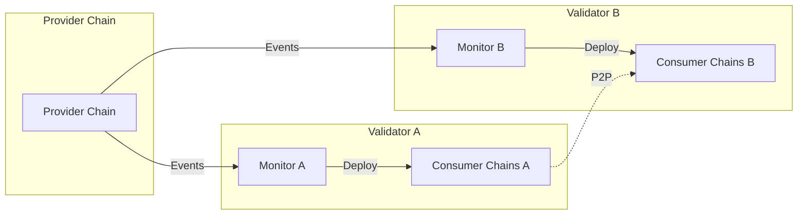

# Interchain Security Monitor

An orchestration layer for Cosmos Interchain Security that automates validator operations and consumer chain deployments using a stateless, decentralized architecture.

## 🚀 Quick Start

Get a testnet running with consumer chains in under 5 minutes:

```bash
# One command to set up everything
make quick-start
```

Or step by step:

```bash
# 1. Deploy testnet (3 validators with monitors)
make deploy

# 2. Install LoadBalancer support
./scripts/clusters/install-metallb.sh

# 3. Register validator endpoints
make register-endpoints

# 4. Create a consumer chain
make create-consumer

# 5. Check consumer chain status
make consumer-info CONSUMER_ID=0
```

📖 See the [Quick Start Guide](docs/quick-start.md) for detailed instructions.

## Overview

The Interchain Security Monitor acts as an autonomous orchestrator that:

- Monitors Cross-Chain Validation (CCV) module events from provider chains
- Automates validator opt-in/opt-out decisions for consumer chains
- Manages consumer chain lifecycle (spawn → operate → stop → delete)
- Operates independently without coordination between validators
- Uses stateless peer discovery for production deployments

## Key Features

- 🚀 **Automated Operations**: Handles validator opt-ins and consumer chain deployments automatically
- 🔄 **Stateless Design**: No shared state or coordination required between validators
- 🛡️ **Production Ready**: Battle-tested architecture for real validator infrastructure
- 📊 **Observable**: Comprehensive metrics, logging, and health checks
- 🔧 **Configurable**: Flexible deployment options for different environments

## Documentation

### 🚀 For Operators

- [Installation Guide](docs/operations/installation.md) - Get up and running
- [Configuration Reference](docs/operations/configuration.md) - Configure your deployment
- [Troubleshooting Guide](docs/operations/troubleshooting.md) - Fix common issues
- [Operational Runbooks](docs/operations/runbooks.md) - Standard procedures

### 👩‍💻 For Developers

- [Architecture Overview](docs/architecture/overview.md) - Understand the system
- [Building from Source](docs/development/building.md) - Development setup
- [Testing Guide](docs/development/testing.md) - Run tests
- [API Reference](docs/reference/api.md) - Technical interfaces

### 📚 For Everyone

- [Consumer Chain Lifecycle](docs/architecture/consumer-lifecycle.md) - How chains are managed
- [Command Reference](docs/reference/cli.md) - All available commands
- [Glossary](docs/reference/glossary.md) - Terms and concepts

### Documentation Map

```text
📁 Documentation Root
├── 🏗️ Architecture
│   ├── System Overview - High-level architecture
│   ├── Design Decisions - Why we built it this way
│   ├── Consumer Lifecycle - Chain management details
│   └── Security Model - Threat analysis and mitigations
├── 🔧 Operations
│   ├── Installation - Setup instructions
│   ├── Configuration - Config reference
│   ├── Runbooks - Operational procedures
│   ├── Troubleshooting - Problem resolution
│   └── Monitoring - Observability setup
├── 💻 Development
│   ├── Building - Compile from source
│   ├── Testing - Test procedures
│   └── Contributing - How to contribute
└── 📖 Reference
    ├── API - HTTP/gRPC interfaces
    ├── CLI - Command reference
    ├── Events - Event schemas
    └── Glossary - Terminology
```


## Quick Start

### Prerequisites

- Docker
- Kind (Kubernetes in Docker)
- kubectl  
- Helm 3
- Go 1.21+ (for building from source)

### Deploy a Test Network

The monitor uses Helm charts for deployment. The testnet creates 3 validators across 3 Kind clusters:

```bash
# 1. Clone the repository
git clone https://github.com/your-org/monitor.git
cd monitor

# 2. Deploy a 3-validator testnet
make deploy  # This uses Helm to deploy each validator

# 3. Check deployment status
make status

# 4. Create a test consumer chain
make create-consumer

# 5. View monitor logs
make logs TARGET=alice COMPONENT=monitor
```

### Deploy a Single Validator

For production validators, use the Helm chart directly:

```bash
# Create your configuration
cat > my-validator.yaml <<EOF
validator:
  name: myvalidator
  moniker: "My Validator"
keys:
  mnemonic: "your mnemonic..."
chain:
  genesis:
    url: "https://example.com/genesis.json"
peers:
  persistent: ["node-id@peer:26656"]
EOF

# Deploy
helm install myvalidator ./helm/ics-validator -f my-validator.yaml
```

See the [Helm Deployment Guide](docs/helm-deployment-guide.md) for details.

### Multi-Cluster Architecture

Each validator runs in its own Kind cluster to simulate real-world deployments:

```bash
# Cluster management
make create-clusters                  # Create 3 Kind clusters
make delete-clusters                  # Delete all clusters
make reset                           # Full reset and redeploy

# View logs from specific clusters
make logs TARGET=alice COMPONENT=monitor     # Alice's monitor
make logs TARGET=bob COMPONENT=validator     # Bob's validator

# Access specific cluster
make shell TARGET=charlie            # Shell into Charlie's validator

# Consumer chain operations
make list-consumers                  # List all consumer chains
make consumer-status CONSUMER_ID=0   # Check consumer status
make remove-consumer CONSUMER_ID=0   # Remove a consumer chain
```

For detailed instructions, see the [Installation Guide](docs/operations/installation.md).

## System Architecture

The monitor system operates with complete validator independence:



Each validator:
- Runs their own monitor instance
- Makes independent decisions
- Deploys their own consumer chain infrastructure
- No coordination or shared state required

For detailed architecture documentation, see [Architecture Overview](docs/architecture/overview.md).


## Contributing

We welcome contributions! Please see our [Contributing Guide](docs/development/contributing.md) for details.

### Development Setup

```bash
# Clone and setup
git clone https://github.com/your-org/monitor.git
cd monitor

# Install dependencies
go mod download

# Run tests
make test

# Build locally
make build
```

## Support

- 📖 [Documentation](docs/index.md)
- 🐛 [Issue Tracker](https://github.com/your-org/monitor/issues)
- 💬 [Discord Community](https://discord.gg/your-discord)
- 📧 [Email Support](mailto:support@your-org.com)

## License

This project is licensed under the Apache License 2.0 - see the [LICENSE](LICENSE) file for details.
