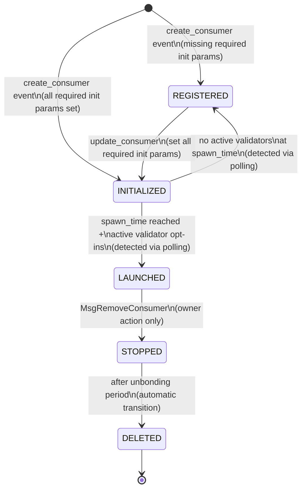

# Consumer Chain Lifecycle

This document provides the authoritative reference for consumer chain lifecycle management in the Interchain Security Monitor system.

## Table of Contents

- [Overview](#overview)
- [Lifecycle Phases](#lifecycle-phases)
- [Phase Transitions](#phase-transitions)
- [Implementation Details](#implementation-details)
- [Removal Process](#removal-process)
- [Troubleshooting Phase Issues](#troubleshooting-phase-issues)

## Overview

Consumer chains in Interchain Security v7 progress through a well-defined lifecycle managed by the provider chain's CCV (Cross-Chain Validation) module. The monitor system tracks these phases and automatically performs actions at each stage.

## Lifecycle Phases

### Phase Diagram



### Phase Descriptions

#### REGISTERED

- **Entry Condition**:
  - Consumer created with missing required initialization parameters
- **Characteristics**:
  - Consumer exists but cannot be launched
  - Validators can opt-in but chain won't start
  - Most commonly missing `spawn_time`
- **Monitor Actions**:
  - Store consumer context
  - Calculate validator subset (67% deterministic selection)
  - Send opt-in transaction if selected
  - Prepare for future deployment

#### INITIALIZED

- **Entry Condition**:
  - All required initialization parameters are set
- **Required Parameters**:
  - `spawn_time`: Valid future timestamp (not zero/null)
  - `genesis_hash`: Genesis configuration hash
  - `binary_hash`: Binary hash for deterministic builds
  - `unbonding_period`: Chain unbonding period
  - `ccv_timeout_period`: CCV timeout configuration
  - `transfer_timeout_period`: IBC transfer timeout
  - `consumer_redistribution_fraction`: Distribution parameters
  - `blocks_per_distribution_transmission`: Distribution frequency
  - `historical_entries`: Number of historical entries to persist
- **Monitor Actions**:
  - Start spawn time countdown monitoring
  - Prepare base genesis configuration
  - Begin adaptive polling near spawn time
  - Monitor for phase transition

#### LAUNCHED

- **Entry Condition**:
  - Current block time >= spawn_time
  - At least one active (bonded, not jailed) validator has opted in
- **Characteristics**:
  - Consumer chain is ready for deployment
  - CCV genesis patch available from provider
  - Validators begin their duties
- **Monitor Actions**:
  - Fetch CCV genesis patch (with retries)
  - Deploy consumer chain infrastructure
  - Configure peer discovery
  - Start health monitoring
  - Deploy Hermes relayer after 30 seconds

#### STOPPED

- **Entry Condition**:
  - Owner submits `MsgRemoveConsumer`
- **Characteristics**:
  - Chain stops producing blocks
  - Validators cease validation duties
  - Resources can be reclaimed
  - Unbonding period begins
- **Monitor Actions**:
  - Scale deployments to 0 replicas
  - Stop health monitoring
  - Maintain state for unbonding period
  - Clean up active contexts

#### DELETED

- **Entry Condition**:
  - Unbonding period expires after STOPPED
- **Characteristics**:
  - Chain fully removed from provider
  - All resources can be deleted
  - No further tracking needed
- **Monitor Actions**:
  - Delete all Kubernetes resources
  - Remove from internal tracking
  - Clean up any remaining state

## Phase Transitions

### Transition Detection

**IMPORTANT**: The provider chain only emits events for explicit messages (`create_consumer`, `update_consumer`, `remove_consumer`). Automatic phase transitions during block processing do NOT emit events.

| Transition | Trigger | Detection Method | Notes |
|------------|---------|------------------|-------|
| None → REGISTERED | MsgCreateConsumer | `create_consumer` event | Missing init params |
| None → INITIALIZED | MsgCreateConsumer | `create_consumer` event | All init params valid |
| REGISTERED → INITIALIZED | MsgUpdateConsumer | `update_consumer` event | Init params completed |
| INITIALIZED → LAUNCHED | BeginBlock processing | Polling only | No event emitted |
| INITIALIZED → REGISTERED | BeginBlock processing | Polling only | Launch failure |
| LAUNCHED → STOPPED | MsgRemoveConsumer | Event + polling | Immediate transition |
| STOPPED → DELETED | BeginBlock processing | Polling only | After unbonding |

### Polling Strategy

The monitor employs an adaptive polling strategy to detect phase changes:

```go
// Polling intervals based on context
const (
    BackgroundSyncInterval = 30 * time.Second  // General sync
    SpawnCheckInterval     = 5 * time.Second   // Pre-spawn monitoring
    RapidPollInterval      = 1 * time.Second   // 0-30s post-spawn
    ActivePollInterval     = 5 * time.Second   // 30s-2m post-spawn
    SlowPollInterval       = 30 * time.Second  // 2m+ post-spawn
)
```

#### Adaptive Post-Spawn Polling

```go
func calculatePollInterval(timeSinceSpawn time.Duration) time.Duration {
    switch {
    case timeSinceSpawn < 30*time.Second:
        return RapidPollInterval  // 1 second
    case timeSinceSpawn < 2*time.Minute:
        return ActivePollInterval // 5 seconds
    default:
        return SlowPollInterval   // 30 seconds
    }
}
```

## Implementation Details

### Spawn Time Monitoring

When a consumer enters INITIALIZED phase, the monitor starts a dedicated goroutine:

```go
func (s *EventService) monitorSpawnTime(ctx context.Context, consumer types.ConsumerInfo) {
    ticker := time.NewTicker(SpawnCheckInterval)
    defer ticker.Stop()

    for {
        select {
        case <-ctx.Done():
            return
        case <-ticker.C:
            remaining := time.Until(consumer.SpawnTime)
            if remaining <= 0 {
                // Start adaptive polling for LAUNCHED detection
                s.startAdaptivePolling(consumer)
                return
            }
            // Log countdown
            log.Printf("Consumer %s spawn in %v", consumer.ChainID, remaining)
        }
    }
}
```

### CCV Genesis Patch Integration

After detecting LAUNCHED phase:

1. **Query CCV Genesis** (with retries):

   ```bash
   interchain-security-pd query provider consumer-genesis [consumer-id] \
     --node tcp://validator:26657
   ```

2. **Merge with Base Genesis**:

   ```go
   // Base genesis prepared during INITIALIZED
   baseGenesis := prepareBaseGenesis(consumer)

   // CCV patch from provider
   ccvPatch := queryCCVGenesis(consumer.ID)

   // Merge
   finalGenesis := baseGenesis
   finalGenesis.AppState.CCVConsumer = ccvPatch
   ```

3. **Update with Assigned Keys**:

   ```go
   // Replace genesis validators with assigned consumer keys
   for i, val := range ccvPatch.InitialValSet {
       if assignedKey, ok := assignedKeys[val.Address]; ok {
           ccvPatch.InitialValSet[i].PubKey = assignedKey
       }
   }
   ```

## Removal Process

### Phase Requirements

**CRITICAL**: Consumer chains can only be removed when in LAUNCHED phase.

```bash
# Error if not in LAUNCHED:
"error remove consumer: consumer chain is not in its launched phase: %s: invalid phase"
```

### Removal Workflow

1. **Get to LAUNCHED** (if not already):

   ```bash
   # Force launch stuck chains
   ./scripts/lifecycle/force-launch-consumer.sh [consumer-id] -s 30
   ```

2. **Remove Consumer**:

   ```bash
   # Only owner can remove
   ./scripts/lifecycle/remove-consumer.sh [consumer-id]
   ```

3. **Phase Progression**:
   - Immediate: LAUNCHED → STOPPED
   - After unbonding: STOPPED → DELETED

### Handling Stuck Chains

For chains stuck in REGISTERED/INITIALIZED:

```bash
# Option 1: Force launch with all validators
./scripts/lifecycle/force-launch-consumer.sh 0 -s 30

# Option 2: Manual update and opt-ins
# Update spawn time
./scripts/lifecycle/update-consumer.sh 0 -d 60

# Manual validator opt-ins
interchain-security-pd tx provider opt-in [consumer-id] \
  --from validator-key \
  --chain-id provider-1

# Wait for launch, then remove
./scripts/lifecycle/remove-consumer.sh 0
```

## Troubleshooting Phase Issues

### Consumer Stuck in REGISTERED

**Symptoms**: Phase remains REGISTERED, won't transition to INITIALIZED

**Common Causes**:

- Missing spawn_time (shows as "0001-01-01T00:00:00Z")
- Missing genesis_hash or binary_hash
- Invalid parameter values

**Solution**:

```bash
# Check missing parameters
./scripts/lifecycle/list-consumers.sh -d [consumer-id]

# Update with all parameters
./scripts/lifecycle/update-consumer.sh [consumer-id] -d 60
```

### Consumer Reverts from INITIALIZED to REGISTERED

**Symptoms**: Chain was INITIALIZED, reverted to REGISTERED after spawn time

**Causes**:

- No active validators opted in
- Opted-in validators are jailed or unbonded
- Insufficient stake from opted-in validators

**Solution**:

```bash
# Check validator status
./scripts/lifecycle/show-consumer-keys.sh [consumer-id]

# Force launch with all validators
./scripts/lifecycle/force-launch-consumer.sh [consumer-id] -s 30
```

### Consumer Won't Transition to LAUNCHED

**Symptoms**: Spawn time passed but still INITIALIZED

**Causes**:

- Polling hasn't detected transition yet
- No active validators opted in
- Chain parameters invalid

**Debugging**:

```bash
# Check opted-in validators
make show-consumer CONSUMER_ID=[id]

# Check active validator set
interchain-security-pd query staking validators --node tcp://localhost:26657

# Monitor phase transitions
make monitor-events | grep -E "phase|LAUNCHED"
```

## Best Practices

1. **Set Reasonable Spawn Times**: Allow 60-120 seconds for validators to opt-in
2. **Monitor Phase Transitions**: Use adaptive polling for critical transitions
3. **Handle Reversions**: Detect and handle INITIALIZED → REGISTERED reversions
4. **Clean State Management**: Properly clean up resources in each phase
5. **Respect Unbonding**: Never bypass security unbonding periods

## References

- [ICS v7 Specification](https://github.com/cosmos/interchain-security)
- [CCV Module Documentation](https://cosmos.github.io/interchain-security/)
- [Monitor Implementation](https://github.com/your-org/monitor)
