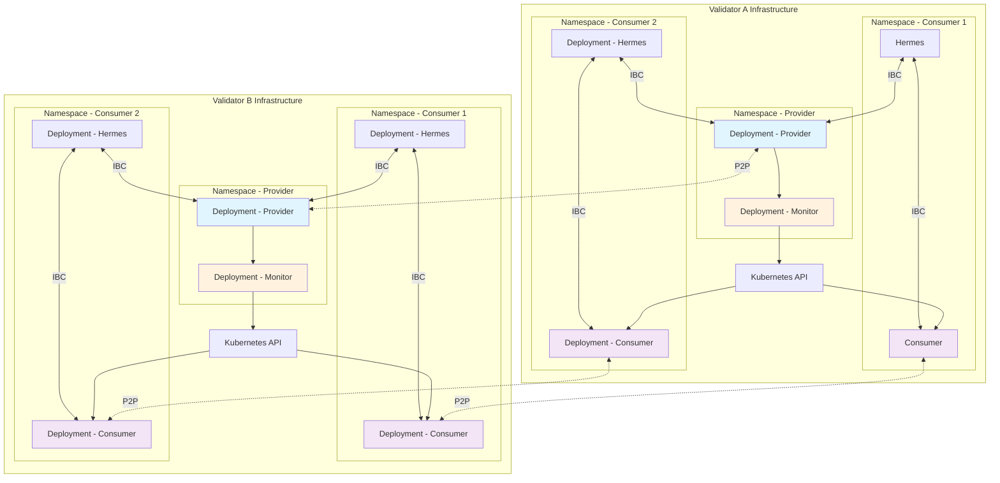
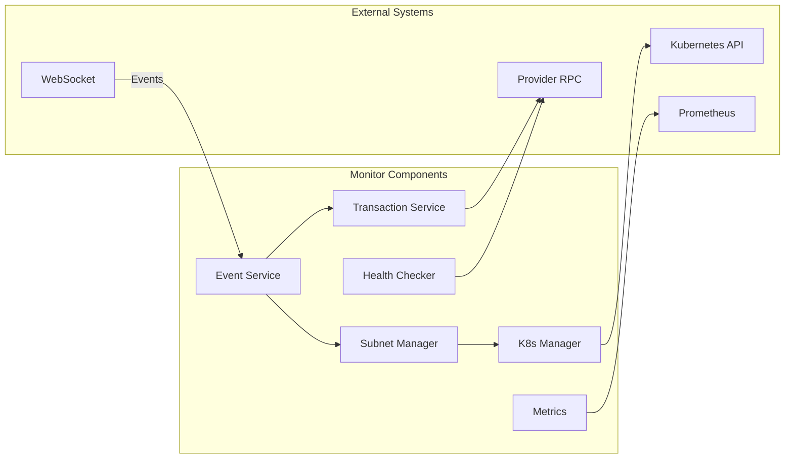
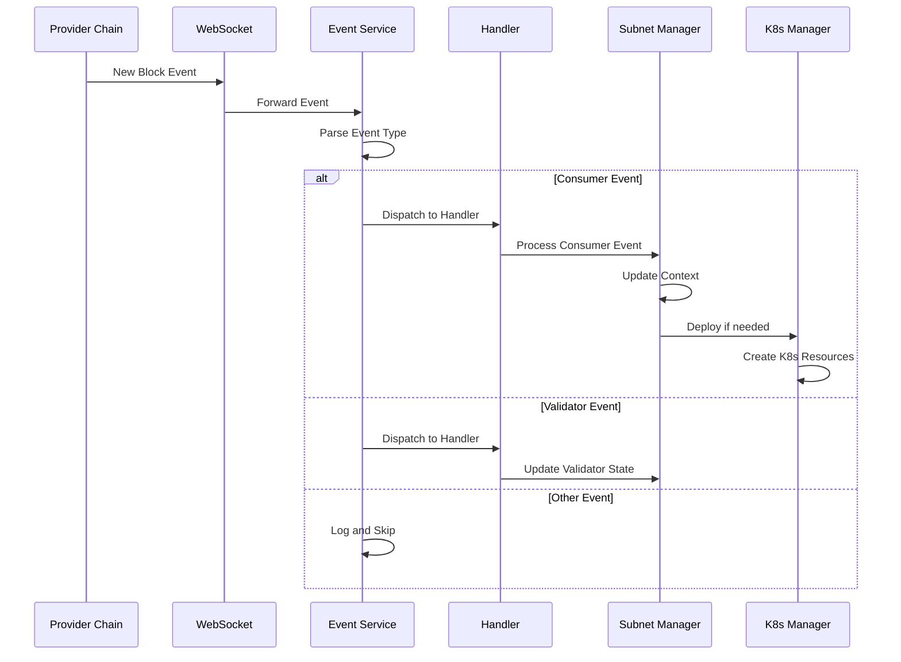
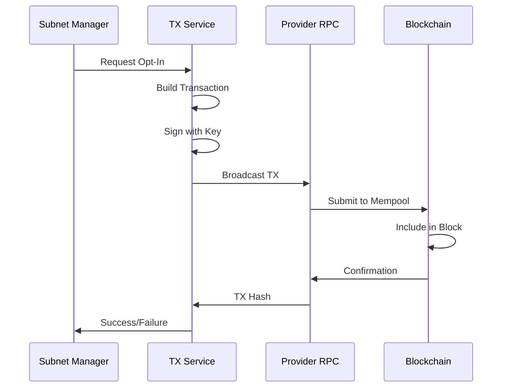
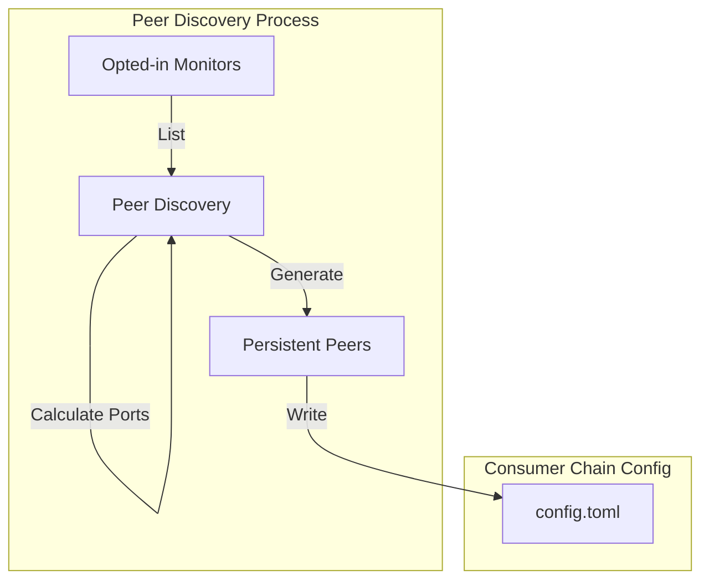
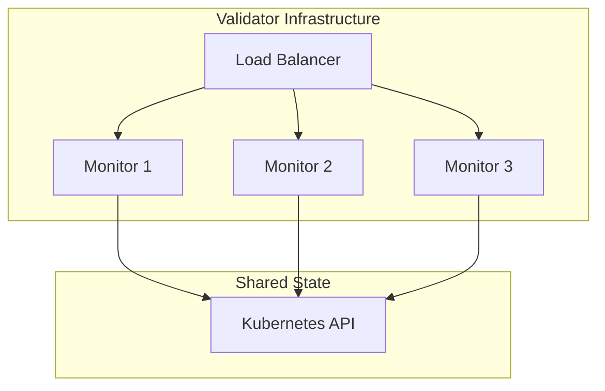
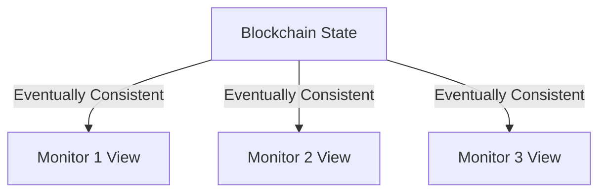

# Architecture Overview

This document provides a comprehensive overview of the Interchain Security Monitor architecture, its components, and how they interact.

## Table of Contents

- [System Architecture](#system-architecture)
- [Component Design](#component-design)
- [Data Flow](#data-flow)
- [Networking Architecture](#networking-architecture)
- [State Management](#state-management)
- [Scalability Considerations](#scalability-considerations)

## System Architecture

### High-Level Architecture




### Key Design Principles

1. **Complete Independence**: Each validator operates autonomously with no shared state
2. **Event-Driven**: Reactive to blockchain events with polling fallback
3. **Deterministic Behavior**: Same inputs produce same outputs across all validators
4. **Failure Isolation**: One validator's issues don't cascade to others
5. **Stateless Operation**: No persistent state beyond blockchain data

## Component Design

### Monitor Service

The monitor is the core orchestration component with these responsibilities:



#### Event Service
- Subscribes to CCV module events via WebSocket
- Maintains persistent connection with automatic reconnection
- Dispatches events to appropriate handlers
- Implements background polling for missed events

#### Subnet Manager
- Implements deterministic validator selection algorithm
- Manages consumer chain contexts and lifecycle
- Coordinates deployment decisions
- Tracks opted-in validators and assignments

#### Transaction Service
- Signs and broadcasts transactions to provider chain
- Handles transaction retry logic
- Manages nonce/sequence numbers
- Monitors transaction confirmations

#### Kubernetes Manager
- Creates and manages Kubernetes resources
- Handles namespace isolation
- Manages ConfigMaps, Deployments, Services
- Implements resource cleanup

#### Health Checker
- Monitors consumer chain health
- Tracks block production
- Detects stalled chains
- Reports metrics

### Consumer Chain Deployment

Each consumer chain deployment consists of:

```yaml
Namespace: <validator>-<chain-id>
├── ConfigMap: genesis
├── ConfigMap: init-script
├── Deployment: consumer-chain
├── Service: p2p/rpc/api/grpc
├── Deployment: hermes-relayer
└── ConfigMap: hermes-config
```

## Data Flow

### Event Processing Flow



### Transaction Flow



## Networking Architecture

### Port Allocation Strategy

The system uses deterministic port allocation to avoid conflicts:

```go
func CalculatePorts(chainID string) Ports {
    hash := sha256.Sum256([]byte(chainID))
    offset := binary.BigEndian.Uint32(hash[:4]) % 1000

    return Ports{
        P2P:  BaseP2PPort + ConsumerOffset + (offset * PortSpacing),
        RPC:  BaseRPCPort + ConsumerOffset + (offset * PortSpacing),
        API:  BaseAPIPort + ConsumerOffset + (offset * PortSpacing),
        GRPC: BaseGRPCPort + ConsumerOffset + (offset * PortSpacing),
    }
}
```

### Peer Discovery



Benefits:
- No centralized discovery service
- Predictable peer addresses
- Works across different networks
- Resilient to node failures

### Network Isolation

```yaml
# Network Policy Example
apiVersion: networking.k8s.io/v1
kind: NetworkPolicy
metadata:
  name: consumer-isolation
  namespace: alice-testchain1-0
spec:
  podSelector:
    matchLabels:
      app: consumer-chain
  policyTypes:
  - Ingress
  - Egress
  ingress:
  - from:
    - namespaceSelector:
        matchLabels:
          validator: alice
    ports:
    - protocol: TCP
      port: 26656  # P2P
  - from:
    - podSelector:
        matchLabels:
          app: hermes
    ports:
    - protocol: TCP
      port: 26657  # RPC
```

## State Management

### Stateless Design Philosophy

The monitor maintains minimal in-memory state:

```go
type MonitorState struct {
    // Ephemeral state only
    ActiveConsumers   map[string]*ConsumerContext
    SpawnMonitors     map[string]context.CancelFunc
    ValidatorCache    *time.LimitedCache

    // No persistent state files
    // All data sourced from blockchain
}
```

### State Recovery

On restart, the monitor:

1. Queries all consumer chains from provider
2. Rebuilds consumer contexts
3. Resumes monitoring active chains
4. Re-establishes WebSocket connections
5. Continues normal operation

### Cache Management

```go
// Time-limited cache for expensive queries
type Cache struct {
    data      map[string]CacheEntry
    ttl       time.Duration
    mu        sync.RWMutex
}

type CacheEntry struct {
    Value     interface{}
    ExpiresAt time.Time
}
```

## Scalability Considerations

### Horizontal Scaling

Each validator can scale independently:



### Resource Limits

Per consumer chain resource allocation:

```yaml
resources:
  requests:
    memory: "512Mi"
    cpu: "500m"
  limits:
    memory: "2Gi"
    cpu: "2000m"
```

### Performance Optimizations

1. **Connection Pooling**: Reuse RPC/gRPC connections
2. **Batch Operations**: Group Kubernetes API calls
3. **Caching**: Cache validator sets and chain states
4. **Lazy Loading**: Only load active consumer contexts
5. **Event Filtering**: Subscribe to specific event types

### Scaling Limits

| Component | Limit | Bottleneck |
|-----------|-------|------------|
| Consumers per Monitor | ~100 | Kubernetes API rate limits |
| Events per Second | ~1000 | WebSocket processing |
| Concurrent Deployments | ~10 | Kubernetes scheduler |
| Transaction Throughput | ~10/block | Blockchain capacity |

## Failure Modes and Recovery

### Component Failures

1. **Monitor Crash**: Kubernetes restarts, state rebuilt from chain
2. **Network Partition**: Continues with cached data, resync on reconnect
3. **Provider Unavailable**: Backoff retry with exponential delay
4. **Consumer Failure**: Health check detects, operator alerted
5. **Kubernetes API Down**: Queue operations, retry when available

### Data Consistency

The blockchain serves as the single source of truth:



## Integration Points

### Provider Chain Integration

- **RPC**: Queries and transaction submission
- **gRPC**: Efficient bulk queries
- **WebSocket**: Real-time event streaming

### Kubernetes Integration

- **API Server**: Resource management
- **Controllers**: Deployment lifecycle
- **Scheduler**: Pod placement
- **DNS**: Service discovery

### Monitoring Integration

- **Prometheus**: Metrics export
- **Grafana**: Dashboards
- **AlertManager**: Alert routing
- **Loki**: Log aggregation

## Future Architecture Considerations

### Potential Enhancements

1. **Multi-Region Deployment**: Deploy consumers across regions
2. **GitOps Integration**: Declarative consumer management
3. **Operator Pattern**: Custom Kubernetes operator
4. **Service Mesh**: Advanced traffic management
5. **Multi-Cloud**: Support multiple cloud providers

### Scaling Strategies

1. **Sharding**: Partition consumers across monitors
2. **Federation**: Cross-validator chain deployment
3. **Edge Deployment**: Deploy closer to users
4. **Hybrid Model**: Mix of containerized and bare-metal

## Conclusion

The Interchain Security Monitor architecture prioritizes:

- **Simplicity**: Minimal moving parts
- **Reliability**: Resilient to failures
- **Independence**: No coordination required
- **Observability**: Comprehensive monitoring
- **Flexibility**: Adaptable to different environments

This architecture has proven effective in production environments, handling dozens of consumer chains across multiple validators with minimal operational overhead.
