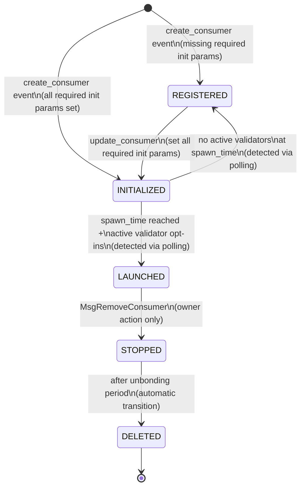

# Consumer Chain Lifecycle

This document provides the authoritative reference for consumer chain lifecycle management in the Interchain Security Monitor system.

## Table of Contents

- [Overview](#overview)
- [Lifecycle Phases](#lifecycle-phases)
- [Phase Transitions](#phase-transitions)
- [Implementation Details](#implementation-details)
- [LoadBalancer Integration](#loadbalancer-integration)
- [Removal Process](#removal-process)
- [Troubleshooting Phase Issues](#troubleshooting-phase-issues)

## Overview

Consumer chains in Interchain Security v7 progress through a well-defined lifecycle managed by the provider chain's CCV (Cross-Chain Validation) module. The monitor system tracks these phases and automatically performs actions at each stage, including LoadBalancer configuration and peer discovery setup.

## Lifecycle Phases

### Phase Diagram



### Phase Descriptions

#### REGISTERED

- **Entry Condition**:
  - Consumer created with missing required initialization parameters
- **Characteristics**:
  - Consumer exists but cannot be launched
  - Validators can opt-in but chain won't start
  - Most commonly missing `spawn_time`
- **Monitor Actions**:
  - Store consumer context
  - Calculate validator subset (66% deterministic selection)
  - Send opt-in transaction if selected
  - Prepare for future deployment

#### INITIALIZED

- **Entry Condition**:
  - All required initialization parameters are set
- **Required Parameters**:
  - `spawn_time`: Valid future timestamp (not zero/null)
  - `genesis_hash`: Genesis configuration hash
  - `binary_hash`: Binary hash for deterministic builds
  - `unbonding_period`: Chain unbonding period
  - `ccv_timeout_period`: CCV timeout configuration
  - `transfer_timeout_period`: IBC transfer timeout
  - `consumer_redistribution_fraction`: Distribution parameters
  - `blocks_per_distribution_transmission`: Distribution frequency
  - `historical_entries`: Number of historical entries to persist
- **Monitor Actions**:
  - Start spawn time countdown monitoring
  - Prepare base genesis configuration
  - Begin adaptive polling near spawn time
  - Monitor for phase transition

#### LAUNCHED

- **Entry Condition**:
  - Current block time >= spawn_time
  - At least one active (bonded, not jailed) validator has opted in
- **Characteristics**:
  - Consumer chain is ready for deployment
  - CCV genesis patch available from provider
  - Validators begin their duties
- **Monitor Actions**:
  - Fetch CCV genesis patch (with retries)
  - Deploy consumer chain infrastructure
  - Configure LoadBalancer services
  - Create EndpointSlices for routing
  - Set up peer discovery
  - Start health monitoring
  - Deploy Hermes relayer after 30 seconds

#### Late-Joining Validators

- **Entry Condition**:
  - Validator opts in AFTER spawn time
  - Validator is NOT in the initial validator set
  - Consumer chain is already in LAUNCHED phase
- **Characteristics**:
  - Validator deploys as a non-validator node
  - Node syncs the blockchain but doesn't produce blocks
  - Waits for VSC (Validator Set Change) from provider
- **Monitor Actions**:
  - Check if validator is opted in (via provider query)
  - Deploy consumer chain with same genesis as initial validators
  - Use provider key or assigned consumer key
  - Monitor for VSC packets that add validator
  - Automatically transition to block production when added

**Implementation Note**: The monitor now supports late-joining validators who opt in after the consumer chain launches. These validators will deploy the consumer chain and sync as non-validators until the provider chain sends a VSC packet adding them to the active set.

#### STOPPED

- **Entry Condition**:
  - Owner submits `MsgRemoveConsumer`
- **Characteristics**:
  - Chain stops producing blocks
  - Validators cease validation duties
  - Resources can be reclaimed
  - Unbonding period begins
- **Monitor Actions**:
  - Scale deployments to 0 replicas
  - Stop health monitoring
  - Maintain state for unbonding period
  - Clean up active contexts
  - Remove LoadBalancer resources

#### DELETED

- **Entry Condition**:
  - Unbonding period expires after STOPPED
- **Characteristics**:
  - Chain fully removed from provider
  - All resources can be deleted
  - No further tracking needed
- **Monitor Actions**:
  - Delete all Kubernetes resources
  - Remove from internal tracking
  - Clean up any remaining state

## Phase Transitions

### Transition Detection

**IMPORTANT**: The provider chain only emits events for explicit messages (`create_consumer`, `update_consumer`, `remove_consumer`). Automatic phase transitions during block processing do NOT emit events.

| Transition | Trigger | Detection Method | Notes |
|------------|---------|------------------|-------|
| None → REGISTERED | MsgCreateConsumer | `create_consumer` event | Missing init params |
| None → INITIALIZED | MsgCreateConsumer | `create_consumer` event | All init params valid |
| REGISTERED → INITIALIZED | MsgUpdateConsumer | `update_consumer` event | Init params completed |
| INITIALIZED → LAUNCHED | BeginBlock processing | Polling only | No event emitted |
| INITIALIZED → REGISTERED | BeginBlock processing | Polling only | Launch failure |
| LAUNCHED → STOPPED | MsgRemoveConsumer | Event + polling | Immediate transition |
| STOPPED → DELETED | BeginBlock processing | Polling only | After unbonding |

### Polling Strategy

The monitor employs an adaptive polling strategy to detect phase changes:

```go
// Polling intervals based on context
const (
    BackgroundSyncInterval = 30 * time.Second  // General sync
    SpawnCheckInterval     = 5 * time.Second   // Pre-spawn monitoring
    RapidPollInterval      = 1 * time.Second   // 0-30s post-spawn
    ActivePollInterval     = 3 * time.Second   // 30s-2m post-spawn
    SlowPollInterval       = 10 * time.Second  // 2m+ post-spawn
)

// Spawn monitoring context with cancellation
type SpawnMonitor struct {
    consumerID string
    cancel     context.CancelFunc
}
```

## Implementation Details

### Spawn Time Monitoring

When a consumer enters INITIALIZED phase, the monitor starts a dedicated goroutine:

```go
func (h *ConsumerHandler) startSpawnMonitoring(ctx context.Context, consumer ConsumerInfo) {
    // Create cancellable context
    monitorCtx, cancel := context.WithCancel(ctx)

    // Store monitor for later cancellation
    h.spawnMonitors.Store(consumer.ConsumerID, &SpawnMonitor{
        consumerID: consumer.ConsumerID,
        cancel:     cancel,
    })

    // Start monitoring in background
    go h.monitorSpawnTime(monitorCtx, consumer)
}
```

### Deployment Decision Logic

After detecting LAUNCHED phase, the monitor follows this decision tree:

```go
func (h *ConsumerHandler) handleLaunchedPhase(ctx context.Context, consumerID, chainID string) error {
    // 1. Check if validator is in initial set
    keyInfo, err := h.isLocalValidatorInInitialSet(consumerCtx.CCVPatch, consumerID)

    // 2. Check if validator is opted in (NEW)
    isOptedIn, err := h.isLocalValidatorOptedIn(ctx, consumerID)

    // 3. Decision logic
    if !keyInfo.Found && !isOptedIn {
        // Not in initial set AND not opted in → Skip deployment
        return nil
    }

    if !keyInfo.Found && isOptedIn {
        // Not in initial set BUT opted in → Deploy as non-validator
        h.logger.Info("Deploying as non-validator, will join via VSC")
    } else {
        // In initial set → Deploy as validator
        h.logger.Info("Deploying as validator in initial set")
    }

    // 4. Select appropriate key
    if keyInfo.Found {
        consumerKey = h.selectConsumerKey(consumerID, keyInfo)
    } else if isOptedIn {
        // Check for assigned consumer key or use provider key
        consumerKey = h.selectKeyForLateJoiner(consumerID)
    }

    // 5. Deploy consumer chain
    return h.k8sManager.DeployConsumerWithDynamicPeers(...)
}
```

### CCV Genesis Patch Integration

After the deployment decision:

1. **Query CCV Genesis** (with retries):

   ```go
   // Query provider for CCV genesis patch
   ccvGenesis, err := h.queryCCVGenesis(ctx, consumer.ConsumerID)
   if err != nil {
       return fmt.Errorf("failed to get CCV genesis: %w", err)
   }
   ```

2. **Update with Assigned Consumer Keys**:

   The CCV genesis patch contains the initial validator set. If validators have assigned consumer keys, these must be updated in the genesis before deployment:

   ```go
   // Get assigned consumer keys from ConsumerKeyStore
   assignedKeys, err := h.consumerKeyStore.GetAssignedKeys(consumer.ConsumerID)
   if err != nil {
       return fmt.Errorf("failed to get assigned keys: %w", err)
   }

   // Update initial validator set with assigned keys
   for i, validator := range ccvGenesis.InitialValSet {
       providerAddr := validator.Address

       // Check if this validator has an assigned consumer key
       if consumerKey, exists := assignedKeys[providerAddr]; exists {
           // Update to use the assigned consumer key
           ccvGenesis.InitialValSet[i].PubKey = formatConsumerKey(consumerKey)
           h.logger.Info("Updated validator with assigned consumer key",
               "validator", providerAddr,
               "consumer_key", consumerKey)
       }
   }
   ```

3. **Key Format Handling**:

   Consumer keys can be in different formats and must be converted to the simple ed25519 format for ICS v7:

   ```go
   // Convert key formats for ICS v7 compatibility
   func formatConsumerKey(key string) string {
       // Handle PubKeyEd25519{hex} format from older versions
       if strings.HasPrefix(key, "PubKeyEd25519{") {
           hexKey := strings.TrimSuffix(strings.TrimPrefix(key, "PubKeyEd25519{"), "}")
           keyBytes, _ := hex.DecodeString(hexKey)
           base64Key := base64.StdEncoding.EncodeToString(keyBytes)
           return fmt.Sprintf(`{"ed25519": "%s"}`, base64Key)
       }

       // Already in correct format
       if strings.Contains(key, "ed25519") {
           return key
       }

       // Assume base64 encoded key
       return fmt.Sprintf(`{"ed25519": "%s"}`, key)
   }
   ```

## LoadBalancer Integration

### LoadBalancer Setup During LAUNCHED Phase

When a consumer chain reaches LAUNCHED phase, the monitor configures LoadBalancer services to expose the ports
so the peers can be routed from the load balancer:

1. **Port Calculation**:

   ```go
   // Calculate deterministic ports for consumer chain
   ports := subnet.CalculatePorts(consumer.ChainID)
   // P2P: 26656 + 100 + (SHA256(chainID) % 1000) * 10
   // RPC: 26657 + 100 + (SHA256(chainID) % 1000) * 10
   ```

2. **LoadBalancer Service Creation**:

   ```go
   // Create P2P LoadBalancer service
   lbService := &v1.Service{
       ObjectMeta: metav1.ObjectMeta{
           Name:      fmt.Sprintf("p2p-%s", consumer.ChainID),
           Namespace: namespace,
           Labels: map[string]string{
               "app":               "consumer-chain",
               "consumer-chain-id": consumer.ChainID,
               "service-type":      "p2p-loadbalancer",
           },
       },
       Spec: v1.ServiceSpec{
           Type: v1.ServiceTypeLoadBalancer,
           Selector: map[string]string{
               "app":               "validator",
               "consumer-chain-id": consumer.ChainID,
           },
           Ports: []v1.ServicePort{{
               Name:       "p2p",
               Port:       int32(ports.P2P),
               TargetPort: intstr.FromInt(26656),
               Protocol:   v1.ProtocolTCP,
           }},
       },
   }

   // Apply cloud-specific LoadBalancer annotations
   if annotations := h.getLoadBalancerAnnotations(); annotations != nil {
       lbService.Annotations = annotations
   }
   ```

3. **EndpointSlice Creation**:

   After the LoadBalancer receives an external IP:

   ```go
   // Create EndpointSlice for consumer chain routing
   endpointSlice := &discoveryv1.EndpointSlice{
       ObjectMeta: metav1.ObjectMeta{
           Name:      fmt.Sprintf("p2p-%s", consumer.ChainID),
           Namespace: namespace,
           Labels: map[string]string{
               "kubernetes.io/service-name": fmt.Sprintf("p2p-%s", consumer.ChainID),
               "consumer-chain-id":          consumer.ChainID,
           },
       },
       AddressType: discoveryv1.AddressTypeIPv4,
       Endpoints: []discoveryv1.Endpoint{{
           Addresses: []string{externalIP},
           Conditions: discoveryv1.EndpointConditions{
               Ready: &ready,
           },
       }},
       Ports: []discoveryv1.EndpointPort{{
           Name:     stringPtr("p2p"),
           Port:     int32Ptr(int32(ports.P2P)),
           Protocol: protocolPtr(v1.ProtocolTCP),
       }},
   }
   ```

### Peer Discovery Configuration

Consumer chains discover peers through the LoadBalancer endpoints:

1. **Query On-Chain Registry**:

   ```go
   // Get registered validator endpoints from provider chain
   endpoints, err := h.queryValidatorEndpoints(ctx)
   ```

2. **Generate Persistent Peers**:

   ```go
   // Build persistent peers list for consumer chain
   var peers []string
   for _, validator := range optedInValidators {
       if endpoint, exists := endpoints[validator.Address]; exists {
           nodeID := h.getNodeID(validator)
           peer := fmt.Sprintf("%s@%s:%d", nodeID, endpoint.IP, ports.P2P)
           peers = append(peers, peer)
       }
   }
   persistentPeers := strings.Join(peers, ",")
   ```

3. **Update Consumer Configuration**:

   ```go
   // Configure consumer chain with discovered peers
   configUpdate := map[string]string{
       "persistent_peers": persistentPeers,
       "p2p.laddr":       fmt.Sprintf("tcp://0.0.0.0:%d", 26656),
   }
   ```

## Removal Process

### Phase Requirements

**CRITICAL**: Consumer chains can only be removed when in LAUNCHED phase.

```bash
# Error if not in LAUNCHED:
"error remove consumer: consumer chain is not in its launched phase: %s: invalid phase"
```

### Removal Workflow

1. **Get to LAUNCHED** (if not already):

   ```bash
   # Force launch stuck chains
   ./scripts/lifecycle/force-launch-consumer.sh [consumer-id] -s 30
   ```

2. **Remove Consumer**:

   ```bash
   # Only owner can remove
   ./scripts/lifecycle/remove-consumer.sh [consumer-id]
   ```

3. **Phase Progression**:
   - Immediate: LAUNCHED → STOPPED
   - After unbonding: STOPPED → DELETED

4. **Resource Cleanup**:
   - LoadBalancer services deleted
   - EndpointSlices removed
   - Kubernetes namespace deleted

## Troubleshooting Phase Issues

### Consumer Stuck in REGISTERED

**Symptoms**: Phase remains REGISTERED, won't transition to INITIALIZED

**Common Causes**:

- Missing spawn_time (shows as "0001-01-01T00:00:00Z")
- Missing genesis_hash or binary_hash
- Invalid parameter values

**Solution**:

```bash
# Check missing parameters
make show-consumer CONSUMER_ID=0

# Update with all parameters
./scripts/lifecycle/update-consumer.sh 0 -d 60
```

### Consumer Chain Not Producing Blocks

**Symptoms**: Chain deployed but height stays at 0

**Common Causes**:

1. **Consumer Key Mismatch**:
   - CCV genesis doesn't have correct assigned keys
   - Check monitor logs for "CCV patch update" messages

2. **Port Allocation Issues**:
   - Consumer chains using wrong ports
   - LoadBalancer not routing to correct ports

3. **Peer Discovery Failure**:
   - Validators can't find each other
   - LoadBalancer endpoints not registered

**Solution**:

```bash
# Check LoadBalancer status
kubectl -n alice-testchain-0 get svc

# Verify peer configuration
kubectl -n alice-testchain-0 exec validator-testchain-0 -- \
  grep persistent_peers /chain/.testchain/config/config.toml

# Check assigned keys in CCV genesis
kubectl -n alice-testchain-0 get configmap ccv-genesis -o yaml | \
  grep -A 5 initial_val_set
```

### LoadBalancer IP Pending

**Symptoms**: LoadBalancer service shows `<pending>` for EXTERNAL-IP

**Solution for Kind clusters**:

```bash
# Install MetalLB
./scripts/clusters/install-metallb.sh

# Wait for LoadBalancer IP assignment
kubectl -n provider wait --for=jsonpath='{.status.loadBalancer.ingress[0].ip}' \
  svc/p2p-loadbalancer-alice --timeout=300s
```

### Late-Joining Validator Not Producing Blocks

**Symptoms**: Validator opted in after launch, deployed successfully, but not producing blocks

**Common Causes**:

1. **VSC Not Yet Sent**: Provider chain hasn't sent validator set update
2. **Wrong Key Used**: Validator using different key than registered with provider
3. **Peer Connectivity**: New validator can't connect to existing validators

**Solution**:

```bash
# Check if validator is in current validator set
interchain-security-pd query provider consumer-validators 0

# Check if validator has opted in
interchain-security-pd query provider consumer-opted-in-validators 0 | grep <validator>

# Verify consumer chain is syncing
kubectl logs -n <namespace> <consumer-pod> | grep "Syncing"

# Check for VSC packets in Hermes logs
kubectl logs -n <namespace> hermes-0 | grep "VSC"
```

**Expected Behavior**:

- Validator syncs blockchain as non-validator
- When VSC arrives, validator automatically starts signing blocks
- No manual intervention required

## Best Practices

1. **Set Reasonable Spawn Times**: Allow 60-120 seconds for validators to opt-in
2. **Monitor Phase Transitions**: Use adaptive polling for critical transitions
3. **Handle Reversions**: Detect and handle INITIALIZED → REGISTERED reversions
4. **Clean State Management**: Properly clean up resources in each phase
5. **Respect Unbonding**: Never bypass security unbonding periods
6. **Configure LoadBalancers**: Apply appropriate cloud provider annotations
7. **Register Endpoints**: Ensure validator endpoints are registered on-chain
8. **Verify Key Assignments**: Check consumer keys are properly updated in CCV genesis
9. **Support Late Joiners**: Always check opted-in status, not just initial set
10. **Monitor VSC Flow**: Track VSC packets to ensure timely validator additions
11. **Use Same Genesis**: Late-joining validators must use the exact same genesis
12. **Verify Peer Connectivity**: Ensure late joiners can connect to existing validators

## Monitoring Late-Joining Validators

### Metrics to Track

- Time between opt-in and deployment
- Time between deployment and first block produced
- Number of validators joining via VSC
- VSC packet relay latency

### Alerts to Configure

- Validator opted in but not deployed within 5 minutes
- Validator deployed but not producing blocks after 30 minutes
- VSC packet relay delays exceeding threshold

## References

- [ICS v7 Specification](https://github.com/cosmos/interchain-security)
- [CCV Module Documentation](https://cosmos.github.io/interchain-security/)
- [Peer Discovery Architecture](peer-discovery.md)
