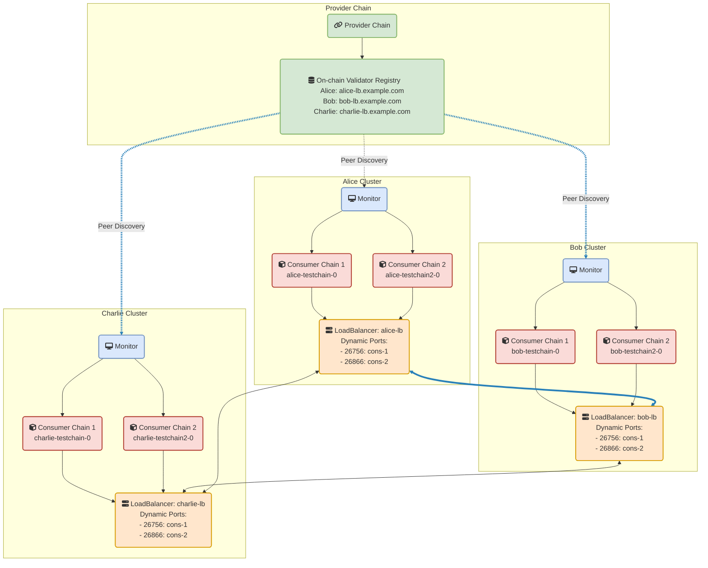

# LoadBalancer-Based Peer Discovery for ICS Consumer Chains

## Overview

This document describes the implementation of peer discovery for ICS consumer chains using LoadBalancer services. The system enables validators in different Kubernetes clusters to discover and connect to each other's consumer chains while strictly following ICS (Interchain Security) specifications.

**Note**: The monitor implementation uses a single, unified peer discovery approach based on LoadBalancer services. This is the production-ready approach for cloud deployments.

## Core Principles

### 1. ICS Compliance

- **Initial validator set**: Only validators in the CCV genesis initial set deploy as validators initially
- **Late-joining validators**: Validators who opt in after genesis can still deploy:
  - Deploy as non-validator nodes to sync the chain
  - Automatically promoted to validators when VSC arrives
  - Use same genesis and peer discovery as initial validators
- Initial validator set contains the keys that will be used for consensus:
  - Consumer consensus keys for validators who assigned consumer keys before spawn time
  - Provider consensus keys for validators who did NOT assign consumer keys
- The provider chain automatically handles this when generating the CCV patch
- No random subset selection or pre-determination of validators
- Monitors must honor the provider chain's CCV genesis for initial deployment
- Monitors should check opted-in status for late joiners

### 2. Direct TCP Connectivity

- Tendermint P2P protocol requires direct TCP connections (no proxies)
- Uses SecretConnection encryption that is incompatible with TCP proxies
- LoadBalancer services provide direct TCP exposure
- TCP proxies (Traefik, HAProxy, nginx) cause protocol errors: `auth failure: secret conn failed: proto: BytesValue: wiretype end group for non-group`

### 3. Deterministic Configuration

- All validators calculate the same ports using chain ID hash
- All monitors construct identical genesis files (including sorting fields)
- Peer discovery uses on-chain validator registry
- All monitors run the same opt-in algorithm based on voting power
- No hardcoded validator lists or fallback mechanisms

## Architecture

### System Components


### Namespace Organization

- **Provider Namespace** (`provider`): Contains Provider chain and Monitor deployments
- **Consumer Namespaces** (`{validator}-{chain-id}`): Each consumer chain gets its own namespace
  - Example: `alice-testchain-0`, `bob-testchain-0`
  - Contains: Consumer chain deployment + Hermes relayer deployment

## Implementation Flow

### 1. Consumer Chain Creation

```text
User submits create-consumer transaction
    │
    ▼
Provider chain creates consumer (INITIALIZED phase)
    │
    ▼
Monitors determine opt-in using deterministic algorithm
    │
    ▼
Selected validators opt-in before spawn time
    │
    ▼
Validators optionally assign consumer keys
    │
    ▼
At spawn time: Provider determines initial validator set
    │
    ▼
Consumer transitions to LAUNCHED phase
    │
    ▼
CCV genesis generated with initial validator set
```

### 2. Deterministic Opt-in Algorithm

The opt-in algorithm has two distinct phases:

1. **Pre-spawn Decision**: Monitors determine which validators SHOULD opt-in
2. **Post-launch Deployment**: Monitors query ACTUAL opted-in validators from CCV genesis

**Note**: The implementation correctly queries validators at the event height to ensure perfect determinism. All monitors query at the same block height (from the consumer creation event) to guarantee they see the same validator set.

```go
// Phase 1: When consumer is created, determine if validator should opt-in
func shouldOptIn(consumerID string, eventHeight int64) bool {
    // Query all bonded validators at the event height
    // This ensures determinism across all monitors
    validators := queryBondedValidatorsAtHeight(eventHeight)

    // Sort by tokens (voting power) descending
    // Tiebreaker: operator address for determinism
    sort.Slice(validators, func(i, j int) bool {
        if validators[i].Tokens.Equal(validators[j].Tokens) {
            return validators[i].OperatorAddress < validators[j].OperatorAddress
        }
        return validators[i].Tokens.GT(validators[j].Tokens)
    })

    // Calculate total voting power
    totalPower := sdk.ZeroInt()
    for _, val := range validators {
        totalPower = totalPower.Add(val.Tokens)
    }

    // Select validators until we reach 66% voting power
    // This ensures 2 out of 3 equal validators are selected
    targetPower := totalPower.MulRaw(66).QuoRaw(100)  // 66%
    selectedPower := sdk.ZeroInt()

    for _, validator := range validators {
        selectedPower = selectedPower.Add(validator.Tokens)

        // Check if local validator is in the selection
        if validator.IsLocal() {
            return true  // Should opt-in
        }

        if selectedPower.GTE(targetPower) {
            break
        }
    }

    return false  // Should not opt-in
}

// Phase 2: After consumer reaches LAUNCHED, deploy if in initial validator set
// The actual validators come from the CCV genesis, not our selection
```

### 3. Monitor Deployment Decision

```go
// When consumer reaches LAUNCHED phase:
func HandlePhaseTransition(consumerID, chainID string, newPhase string) {
    if newPhase != "CONSUMER_PHASE_LAUNCHED" {
        return
    }

    // 1. Fetch CCV genesis from provider
    ccvGenesis := queryCCVGenesis(consumerID)

    // 2. Check if local validator is in initial set
    inInitialSet := isLocalValidatorInInitialSet(ccvGenesis)

    // 3. Check if local validator has opted in (NEW)
    isOptedIn := isLocalValidatorOptedIn(consumerID)

    // 4. Deployment decision
    if !inInitialSet && !isOptedIn {
        log("Not in initial set and not opted in, skipping deployment")
        return
    }

    if !inInitialSet && isOptedIn {
        log("Not in initial set but opted in - deploying as non-validator")
        log("Will join active set when VSC arrives from provider")
    }

    // 5. Deploy consumer chain (as validator or non-validator)
    deployConsumerChain(chainID, ccvGenesis)

    // 6. Configure LoadBalancer and peer discovery (same for all)
    ports := calculatePorts(chainID)
    configureLoadBalancer(chainID, ports)
    peers := discoverPeers(chainID, ccvGenesis.InitialValSet)
    configureConsumerPeers(chainID, peers)
}
```

### 4. Initial Validator Set Checking

The simplified implementation checks only the provider consensus key:

```go
func isLocalValidatorInInitialSet(ccvGenesis CCVGenesis) bool {
    localValidator := getLocalValidatorInfo()

    // Initial validator set always uses provider consensus keys
    providerKey := localValidator.ProviderConsensusKey

    // Check against initial validator set
    for _, validator := range ccvGenesis.InitialValSet {
        if validator.PubKey == providerKey {
            return true
        }
    }

    return false
}
```

### 5. Deterministic Genesis Construction

When building the consumer genesis, monitors must ensure all validators have identical genesis files. The CCV genesis patch includes consumer key assignments:

```go
func buildConsumerGenesis(ccvPatch CCVGenesis, consumerID string) Genesis {
    // The CCV patch from the provider chain already contains the correct keys:
    // - Consumer keys for validators who assigned them
    // - Provider keys for validators who didn't assign them

    // Update with assigned consumer keys if needed
    // This is handled by the K8s deployer when creating the consumer chain

    genesis := ccvPatch

    // Sort all fields to ensure deterministic ordering
    sortGenesisFields(&genesis)

    return genesis
}
```

### 6. Peer Discovery

The monitor uses LoadBalancer-based peer discovery:

```go
func discoverPeersWithLoadBalancer(chainID string, initialValSet []Validator) []string {
    // 1. Get validator endpoints from on-chain registry
    endpoints := getValidatorEndpoints()

    // 2. Calculate deterministic consumer P2P port
    ports := calculatePorts(chainID)

    // 3. Build peer list from initial validator set
    var peers []string
    for _, validator := range initialValSet {
        validatorName := getValidatorName(validator)

        if validatorName == localValidator {
            continue // Skip self
        }

        // Get LoadBalancer endpoint from registry
        endpoint := endpoints[validatorName]
        if endpoint == "" {
            log.Warn("No endpoint found for validator", validatorName)
            continue
        }

        // Get node ID for the validator
        nodeID := getNodeID(validator)

        // Build peer address: nodeID@loadbalancer:port
        peer := fmt.Sprintf("%s@%s:%d", nodeID, endpoint, ports.P2P)
        peers = append(peers, peer)
    }

    return peers
}
```

### 7. Validator Set Updates (VSCs)

Late-joining validators are added to consumer chains through VSC packets:

```go
// VSC Flow for Late Joiners
// 1. Validator opts in after consumer launch
// 2. Provider chain includes validator in next VSC packet
// 3. Hermes relays VSC to consumer chain
// 4. Consumer chain updates validator set
// 5. Late-joiner automatically starts producing blocks

// No code changes needed - handled by CCV module
// Monitor just needs to ensure node is running and synced
```

**Key Points**:

- VSCs are sent periodically by the provider chain
- Consumer chains automatically process validator set changes
- No manual intervention required once deployed
- Late-joining validators use the same deployment process

## Technical Details

### Node ID

The Tendermint/CometBFT node ID is derived from the node's public key:

- Stored in `node_key.json` file
- Can be obtained via `GetNodeInfo` API
- Can be shown with `interchain-security-pd tendermint show-node-id`
- Format: 40-character hex string (e.g., `3b4c06c2c0e8f6d7a5b9c1a2f3e4d5c6b7a8e9f0`)

### Port Calculation

```go
// From internal/subnet/ports.go
const (
    // Base ports for provider chain
    BaseP2PPort     = 26656
    BaseRPCPort     = 26657
    BaseGRPCPort    = 9090
    BaseGRPCWebPort = 9091

    // Offset for consumer chains
    ConsumerOffset = 100

    // Port spacing between consumer chains
    PortSpacing = 10
)

func CalculatePorts(chainID string) Ports {
    hash := sha256.Sum256([]byte(chainID))
    offset := binary.BigEndian.Uint32(hash[:4]) % 1000

    return Ports{
        P2P:  BaseP2PPort + ConsumerOffset + (offset * PortSpacing),
        RPC:  BaseRPCPort + ConsumerOffset + (offset * PortSpacing),
        GRPC: BaseGRPCPort + ConsumerOffset + (offset * PortSpacing),
    }
}

// Example: chainID "testchain-0" might get:
// P2P:  26656 + 100 + (456 * 10) = 31316
// RPC:  26657 + 100 + (456 * 10) = 31317
// GRPC: 9090  + 100 + (456 * 10) = 13750
```

### LoadBalancer Management

```go
type LoadBalancerManager struct {
    clientset kubernetes.Interface
    logger    *slog.Logger
}

// Creates LoadBalancer service for consumer chain P2P
func (m *LoadBalancerManager) CreateConsumerLoadBalancer(chainID string, namespace string, ports Ports) error {
    service := &v1.Service{
        ObjectMeta: metav1.ObjectMeta{
            Name:      fmt.Sprintf("p2p-%s", chainID),
            Namespace: namespace,
            Labels: map[string]string{
                "app":               "consumer-chain",
                "consumer-chain-id": chainID,
            },
        },
        Spec: v1.ServiceSpec{
            Type: v1.ServiceTypeLoadBalancer,
            Selector: map[string]string{
                "app":               "validator",
                "consumer-chain-id": chainID,
            },
            Ports: []v1.ServicePort{{
                Name:       "p2p",
                Port:       int32(ports.P2P),
                TargetPort: intstr.FromInt(26656), // Container port
                Protocol:   v1.ProtocolTCP,
            }},
        },
    }

    // Apply cloud-specific annotations
    if annotations := m.getLoadBalancerAnnotations(); annotations != nil {
        service.Annotations = annotations
    }

    _, err := m.clientset.CoreV1().Services(namespace).Create(ctx, service, metav1.CreateOptions{})
    return err
}
```

### Event-Based Endpoint Updates

The monitor supports automatic consumer chain updates when validator endpoints change:

```go
type ValidatorUpdateHandler struct {
    validatorRegistry *ValidatorRegistry
    loadBalancerMgr   *LoadBalancerManager
    consumerRegistry  *ConsumerRegistry
    chainUpdater      *ConsumerChainUpdater
    autoUpdate        bool // Feature flag to enable/disable automatic updates
}

func (h *ValidatorUpdateHandler) HandleEvent(event Event) error {
    if event.Type != "edit_validator" {
        return nil
    }

    // Refresh validator endpoints from chain
    endpoints := h.validatorRegistry.RefreshEndpoints()

    // Automatic updates if enabled
    if h.autoUpdate {
        h.logger.Info("Triggering automatic consumer chain updates")

        // Build list of updated validators
        var updatedValidators []UpdatedValidator
        // ... (collect changes)

        // Trigger updates in background
        go h.chainUpdater.UpdateConsumerChainsForValidators(ctx, updatedValidators)
    } else {
        h.logger.Warn("Validator endpoint updated, consumer chains need manual update",
            "validator", event.ValidatorAddress,
            "new_endpoint", endpoints[event.ValidatorAddress])
    }

    return nil
}
```

#### Automatic Update Components

1. **ConsumerRegistry**: Tracks which validators are in which consumer chains
2. **ConsumerChainUpdater**: Updates ConfigMaps and optionally uses RPC for zero-downtime updates
3. **Feature Flags**:
   - `AUTO_UPDATE_CONSUMERS=true` - Enable automatic updates
   - `HYBRID_PEER_UPDATES=true` - Use RPC first, restart only if needed

### Hybrid Peer Updates

When `HYBRID_PEER_UPDATES=true`, the monitor attempts zero-downtime updates:

```go
func (u *ConsumerChainUpdater) hybridUpdatePeers(ctx context.Context, namespace, chainID string) error {
    // 1. Get current peers via RPC
    currentPeers, err := u.getCurrentPeersViaRPC(podIP)

    // 2. Calculate which peers to add
    toAdd := u.calculatePeersToAdd(currentPeers, newPeers)

    // 3. Add peers via RPC (no restart needed)
    for _, peer := range toAdd {
        err := u.addPeerViaRPC(podIP, peer)
        // Handle errors gracefully
    }

    // 4. Verify connectivity
    return u.verifyPeerConnectivity(podIP, expectedPeers)
}
```

**Benefits**:

- Zero downtime for successful updates
- Immediate peer connectivity
- Graceful fallback to restart if RPC fails
- Partial success is acceptable

**Limitations**:

- RPC-added peers are not persistent across restarts
- Cannot remove peers via standard Tendermint RPC
- Requires Tendermint 0.34+ for reliable operation

## Deployment Setup

### For Devnet (Kind + MetalLB)

1. **Install MetalLB**:

```bash
./scripts/clusters/install-metallb.sh
```

2. **Deploy validators with LoadBalancer services**:

```bash
./scripts/devnet/deploy-devnet-helm.sh
```

3. **Register validator endpoints**:

```bash
./scripts/devnet/register-validator-endpoints.sh
```

### For Production

Use cloud provider LoadBalancer with appropriate annotations:

**AWS (NLB)**:

```yaml
metadata:
  annotations:
    service.beta.kubernetes.io/aws-load-balancer-type: "nlb"
    service.beta.kubernetes.io/aws-load-balancer-scheme: "internal"
```

**GCP**:

```yaml
metadata:
  annotations:
    cloud.google.com/load-balancer-type: "Internal"
```

**Azure**:

```yaml
metadata:
  annotations:
    service.beta.kubernetes.io/azure-load-balancer-internal: "true"
```

### Kubernetes Resources

```yaml
# LoadBalancer Service for Provider P2P
apiVersion: v1
kind: Service
metadata:
  name: p2p-loadbalancer
  namespace: provider
spec:
  type: LoadBalancer
  selector:
    app.kubernetes.io/component: validator
    app.kubernetes.io/instance: alice
  ports:
  - name: p2p
    port: 26656
    targetPort: 26656
    protocol: TCP

---
# Consumer LoadBalancer (created by monitor)
apiVersion: v1
kind: Service
metadata:
  name: p2p-testchain-0
  namespace: alice-testchain-0
spec:
  type: LoadBalancer
  selector:
    app: validator
    consumer-chain-id: testchain-0
  ports:
  - name: p2p
    port: 31316  # Calculated port
    targetPort: 26656
    protocol: TCP
```

### Validator Registration

```bash
# Get LoadBalancer endpoint
ENDPOINT=$(kubectl get svc p2p-loadbalancer -n provider \
  -o jsonpath='{.status.loadBalancer.ingress[0].ip}')

# Register on-chain
interchain-security-pd tx staking edit-validator \
  --details "p2p=$ENDPOINT" \
  --from alice \
  --chain-id provider-1 \
  --keyring-backend test
```

## CLI Examples

```bash
# List all launched consumer chains
interchain-security-pd query provider list-consumer-chains 3

# Get specific consumer chain details
interchain-security-pd query provider consumer-chain 0

# Get consumer genesis (CCV patch)
interchain-security-pd query provider consumer-genesis 0

# Get opted-in validators
interchain-security-pd query provider consumer-opted-in-validators 0

# Get initial validator set from CCV genesis
interchain-security-pd query provider consumer-genesis 0 | jq .initial_val_set

# Check if a validator can join late
interchain-security-pd query provider consumer-opted-in-validators 0 | grep <validator>

# Monitor VSC packets (in consumer chain)
interchain-security-cd query ccvconsumer throttle-state

# Verify validator is in current set (after VSC)
interchain-security-cd query tendermint-validator-set
```
