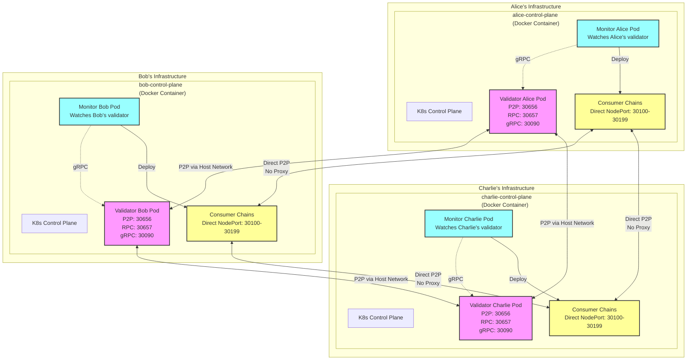
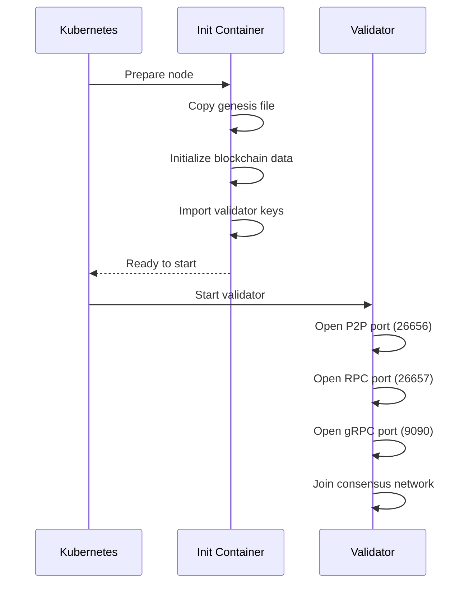
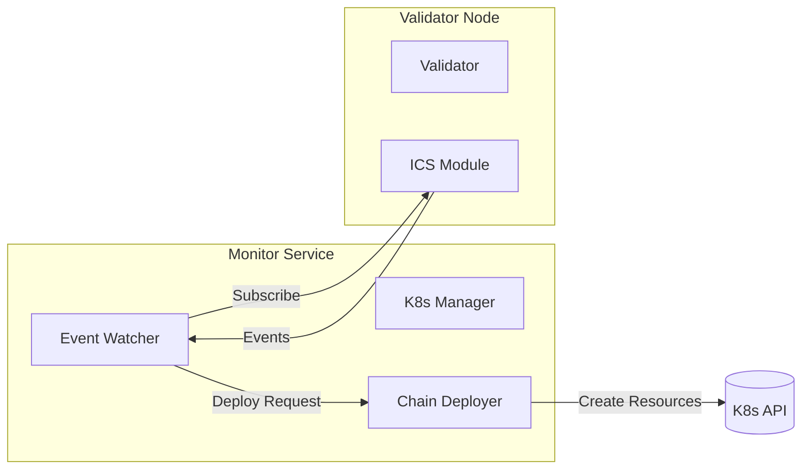
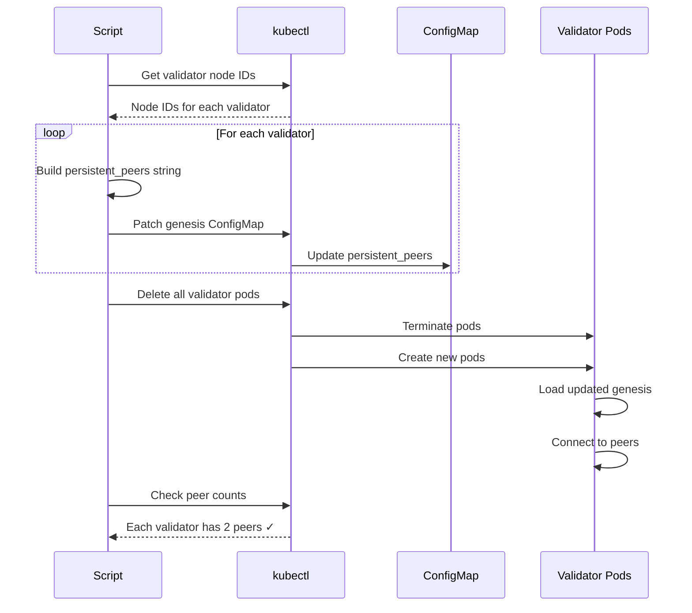
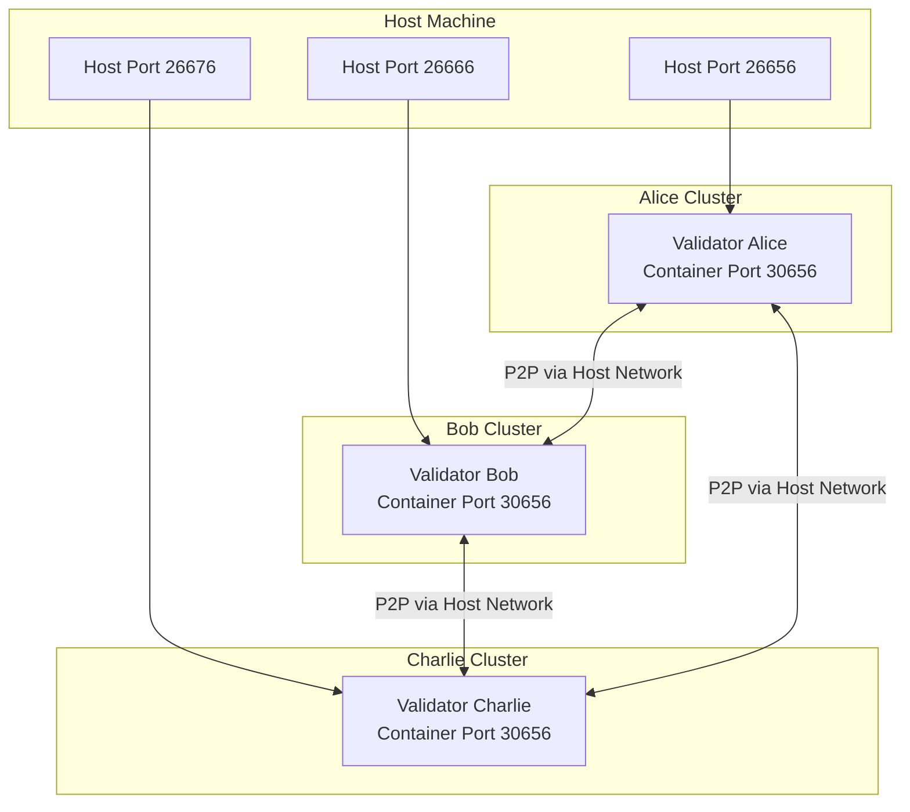
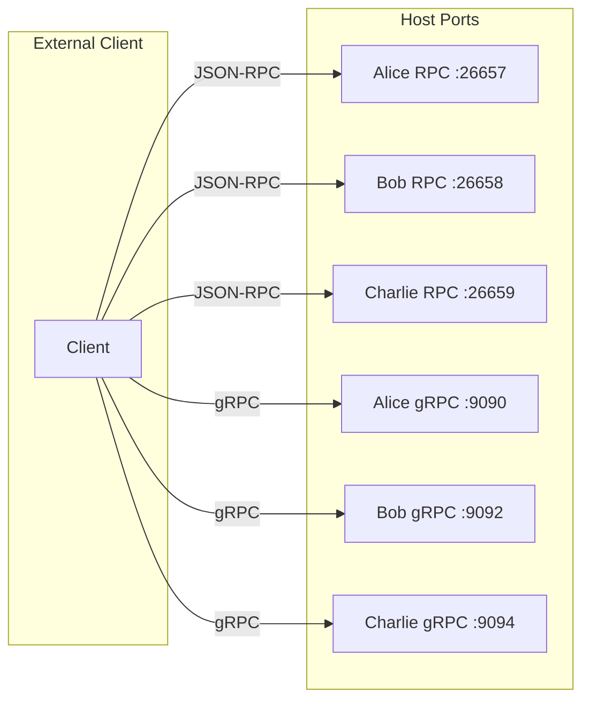
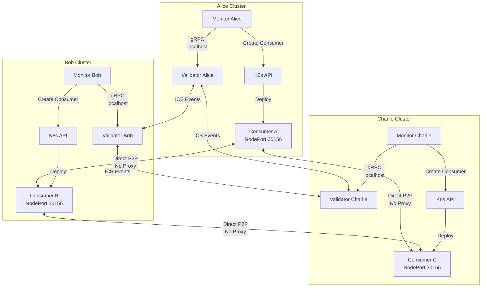

# Testnet Deployment Guide

This guide explains the testnet deployment process and architecture for testing Interchain Security (ICS) consumer chain management in a realistic multi-validator environment.

## Overview

The testnet deployment creates a production-like environment with:

- 3 independent validators (Alice, Bob, Charlie) in isolated Kind clusters
- A provider chain with Interchain Security enabled
- Automated monitor services that manage consumer chain lifecycles
- Full Kubernetes orchestration for realistic deployment scenarios

## Architecture Overview

### Kind Architecture

Kind (Kubernetes IN Docker) provides real Kubernetes clusters while remaining lightweight. The architecture works as follows:

- **Containers as Nodes**: Each Kubernetes "node" is actually a Docker container - this gives us real cluster isolation without the overhead of VMs
- **Complete K8s Stack**: Every Kind node runs the full Kubernetes control plane (API server, etcd, scheduler, etc.)
- **Nested Container Runtime**: Inside each Kind node, containerd manages the actual Kubernetes pods
- **True Network Isolation**: Each validator gets its own cluster with isolated networking, simulating a real multi-datacenter deployment

### Multi-Cluster Architecture



### Cluster Components

Each validator runs in its own Kind cluster to achieve true isolation. Each cluster contains:

1. **Infrastructure Layer** (managed by Kind):
   - Full Kubernetes control plane components
   - Container runtime (containerd) for managing pods
   - Networking stack with CNI plugin
   - All the standard Kubernetes services

2. **Our Application Stack**:
   - **Validator**: The Cosmos SDK node participating in consensus
   - **Monitor**: Our custom service that watches for consumer chain events
   - **LoadBalancer Service**: Shared LoadBalancer that routes to all consumer chains
   - **Consumer Chains**: Deployed dynamically by the monitor when needed
   - **Direct TCP Exposure**: LoadBalancer provides direct TCP routing (no proxy layer)

This design ensures that each validator operates independently, just like in a production environment where validators run in different data centers. The isolation also means that if one validator has issues, it doesn't affect the others.

### Container Layer Stack

```text
Host Machine
├── Docker (manages Kind nodes)
│   ├── alice-control-plane container
│   │   └── Kubernetes environment
│   │       ├── Control plane services
│   │       ├── Validator Alice (your blockchain node)
│   │       └── Monitor Alice (automation service)
│   ├── bob-control-plane container
│   │   └── (isolated Kubernetes environment)
│   └── charlie-control-plane container
│       └── (isolated Kubernetes environment)
```

This layered approach provides production-like isolation while keeping resource usage reasonable. Each validator operates as if running on independent infrastructure, accurately simulating a real deployment.

## Deployment Steps

### Step 1: Clean Previous Deployment

```bash
make clean
```

Starting fresh ensures a clean environment. This command:
- Removes any existing Kind clusters from previous runs
- Cleans up generated configuration files and keys
- Ensures no state carries over between deployments

### Step 2: Create Kind Clusters

This step creates three independent Kubernetes clusters, one for each validator:

```bash
./scripts/clusters/create-clusters.sh
```

The script handles:

- Setting up a custom Docker network for Kind
- Creating three isolated clusters (alice-cluster, bob-cluster, charlie-cluster)
- Configuring unique port mappings for each validator
- Ensuring proper network isolation between clusters

**Cluster Configuration Example:**

Here's Alice's configuration as an example:

```yaml
kind: Cluster
apiVersion: kind.x-k8s.io/v1alpha4
name: alice-cluster
nodes:
- role: control-plane
  extraPortMappings:
  - containerPort: 30656  # P2P
    hostPort: 26656
  - containerPort: 30657  # RPC
    hostPort: 26657
  - containerPort: 31657  # REST API
    hostPort: 1317
  - containerPort: 32090  # gRPC
    hostPort: 9090
networking:
  podSubnet: "10.244.0.0/16"
  serviceSubnet: "10.96.0.0/12"
```

The port mappings are designed to:
- Assign unique host ports to each validator (Alice: 26656, Bob: 26666, Charlie: 26676 for P2P)
- Prevent pod network overlap (Alice: 10.244.x.x, Bob: 10.245.x.x, Charlie: 10.246.x.x)
- Keep services accessible from the host machine for debugging

### Step 3: Build Monitor Docker Image

```bash
docker build -t ics-monitor:latest .
```

This builds the monitor service that watches validators and automatically manages consumer chains.

### Step 4: Generate Testnet Configuration

A genesis ceremony creates the blockchain configuration:

```bash
./scripts/testnet-coordinator.sh -t '2025-01-01T00:00:00Z' -s
```

**The Genesis Ceremony** (testnet-coordinator.sh):
Generates all cryptographic materials needed for a functioning blockchain:
- **Account Keys**: For each validator to sign transactions
- **P2P Keys**: For secure peer-to-peer networking
- **Consensus Keys**: The critical keys for block signing
- **Genesis File**: Initial chain state with all validators registered

**Note**: Kubernetes manifests are no longer generated as static files. The deployment now uses Helm charts with dynamic configuration.

**What Gets Generated:**

```text
testnet/assets/
├── alice/
│   ├── config/
│   │   ├── genesis.json         # Blockchain genesis file
│   │   ├── node_key.json        # P2P networking key
│   │   └── priv_validator_key.json  # Consensus key
│   └── keyring-test/            # Account keys
├── bob/
│   └── (identical structure)
├── charlie/
│   └── (identical structure)
├── node_ids.txt                 # Node IDs for peer connections
└── validators.txt               # Validator addresses
```

### Step 5: Deploy to All Clusters

This step deploys the complete stack using Helm:

```bash
./scripts/deploy-testnet-helm.sh
```

This script:
- Loads the monitor image into each Kind cluster
- Deploys each validator using the Helm chart
- Configures cross-cluster networking
- Sets up proper peer connections

**What Gets Deployed to Each Cluster:**

- **Infrastructure Setup**: Namespace, RBAC rules, and networking components
- **Blockchain Node**: The validator with its keys and genesis configuration
- **Monitor Service**: Our automation that watches the validator and manages consumer chains
- **Consumer Chain Services**: Direct NodePort services for P2P connectivity (30100-30199 range)

Each validator runs completely independently - they don't share any resources except the initial genesis file.

**How a Validator Starts Up:**



### Step 6: Monitors Start Automatically

Monitors are deployed alongside validators and begin operating immediately. Each monitor:

- Connects to its local validator via gRPC
- Subscribes to consumer chain events
- Automatically handles validator opt-ins
- Deploys consumer chains when needed

**Monitor Architecture:**



### Step 7: Wait for Services

This step waits for all services to be ready:

```bash
# Check each cluster
for cluster in alice bob charlie; do
    kubectl --context kind-${cluster}-cluster wait --for=condition=ready pod -l role=validator -n provider --timeout=120s
    kubectl --context kind-${cluster}-cluster wait --for=condition=ready pod -l role=monitor -n provider --timeout=60s || true
done
```

Validators must start first since monitors depend on them. The `|| true` for monitors allows extra time for gRPC connection establishment.

### Step 8: Fix Validator Peer Connections

This critical step enables validators to find each other across clusters:

```bash
./scripts/clusters/fix-multicluster-peers.sh
```

**What This Script Does:**



**Why This Step Is Required:**

Validators start with placeholder peer addresses and don't know about each other initially. Since each validator runs in its own Kind cluster, the script must:

1. Discover each validator's node ID
2. Build the correct peer connection strings using host networking
3. Update each validator's configuration
4. Restart validators to establish connections

This creates a fully connected mesh network where every validator can communicate with every other validator.

**Peer Connection Format:**

Each validator must know how to reach the others using this format:

```text
persistent_peers = "nodeID@address:port,nodeID@address:port"
```

For example, Alice's configuration would include:

```text
persistent_peers = "bob_node_id@host.docker.internal:26666,charlie_node_id@host.docker.internal:26676"
```

The configuration uses `host.docker.internal` because validators connect through the host's network to reach other clusters. Port mappings:

- Alice: P2P on 26656, RPC on 26657, REST on 1317, gRPC on 9090
- Bob: P2P on 26666, RPC on 26658, REST on 1318, gRPC on 9092  
- Charlie: P2P on 26676, RPC on 26659, REST on 1319, gRPC on 9094

## Understanding Network Traffic

### Important Note on TCP Proxy Incompatibility

**Key Learning**: Tendermint's P2P protocol (SecretConnection) is incompatible with TCP proxies like Traefik, HAProxy, or nginx. The protocol performs its own encryption and authentication, and any proxy that modifies the TCP stream will cause protocol errors:

```text
auth failure: secret conn failed: proto: BytesValue: wiretype end group for non-group
```

Therefore, consumer chains must use **direct TCP exposure** via NodePort or LoadBalancer services without any proxy layer.

### P2P Consensus Network



### Client Access Patterns



### How Monitors Interact



### Consumer Chain Networking

Consumer chains deployed by monitors use direct NodePort services for P2P connectivity:

```yaml
apiVersion: v1
kind: Service
metadata:
  name: consumer-testchain1-0
  namespace: alice-testchain1-0
spec:
  type: NodePort
  selector:
    app: consumer-chain
    chain-id: testchain1-0
  ports:
    - name: p2p
      port: 26656
      targetPort: 26656
      nodePort: 30156  # Calculated from chain ID
```

The NodePort is deterministically calculated from the chain ID to ensure all validators use the same port for the same consumer chain.

## Verification

After deployment completes, verify the testnet is working correctly:

```bash
# Check overall status - you should see 3 validators each with 2 peers
make status

# View monitor activity
make logs TARGET=alice COMPONENT=monitor

# Watch a validator's consensus participation
make logs TARGET=alice COMPONENT=validator

# Test the system by creating a consumer chain
make create-consumer
```

Expected results:
- Each validator connected to exactly 2 peers
- Monitors successfully watching for events
- Blocks being produced at regular intervals

## Troubleshooting

### Common Issues and Solutions

1. **Validators not connecting to peers**
   - First check if all clusters are running: `kind get clusters`
   - Verify the peer fix script completed: Look for "Each validator has 2 peers" in the output
   - Check actual connections: `make status` should show peer counts

2. **Monitors failing to start**
   - Monitors depend on validators, so check validator health first
   - Look for gRPC connection errors: `make logs TARGET=alice COMPONENT=monitor`
   - Ensure the validator's gRPC port is accessible

3. **Consumer chains not launching**
   - Monitors must be running to handle consumer chain deployment
   - Check if the chain spawn time has passed (chains can't launch after spawn time)
   - Verify at least one validator has opted in: `make show-consumer CONSUMER_ID=0`

4. **Consumer chains not producing blocks**
   - This is often due to peer discovery issues
   - Check consumer logs for "auth failure: secret conn failed" errors - this indicates TCP proxy interference
   - Ensure consumer chains use direct NodePort services without any TCP proxy
   - Verify peer addresses use correct node IPs and calculated ports

### Useful Debugging Commands

```bash
# See what's running in each cluster
for cluster in alice bob charlie; do
    echo "=== $cluster cluster ==="
    kubectl --context kind-${cluster}-cluster get pods -n provider -o wide
done

# Tail validator logs to see consensus messages
kubectl --context kind-alice-cluster logs -n provider -l role=validator -f

# Check monitor event processing
kubectl --context kind-alice-cluster logs -n provider -l role=monitor -f

# Get detailed peer information
kubectl --context kind-alice-cluster exec -n provider -l role=validator -- \
  curl -s http://localhost:26657/net_info | jq '.result.peers[] | {moniker, is_outbound}'
```

## Summary

The testnet deployment provides:

1. **Complete validator isolation** - separate Kubernetes clusters ensure no shared resources
2. **Autonomous monitor operation** - each monitor independently manages its validator's consumer chains
3. **Production-like networking** - validators communicate through public endpoints as in real deployments
4. **Full automation** - from genesis ceremony to peer discovery
5. **Direct TCP exposure for consumer chains** - avoiding Tendermint P2P protocol incompatibility with proxies

The multi-cluster design provides a realistic testing environment for consumer chain management systems. This architecture helps identify issues that only appear in truly distributed deployments.

**Important Note**: Based on our learnings, consumer chains must use direct TCP exposure (NodePort or LoadBalancer) without any TCP proxy layer. The Tendermint P2P protocol's SecretConnection is incompatible with TCP proxies and will fail with protobuf errors if a proxy is used.

For more details on the networking architecture and production deployment options, see the [Production Peer Discovery](peer-discovery.md) documentation.

For questions or issues, please refer to the [troubleshooting section](#troubleshooting) or open an issue on GitHub.
